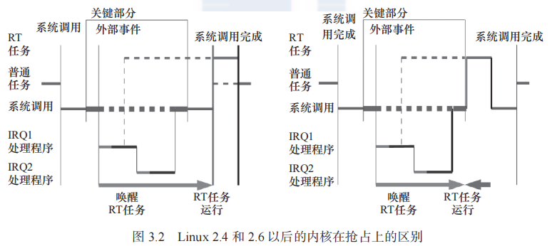
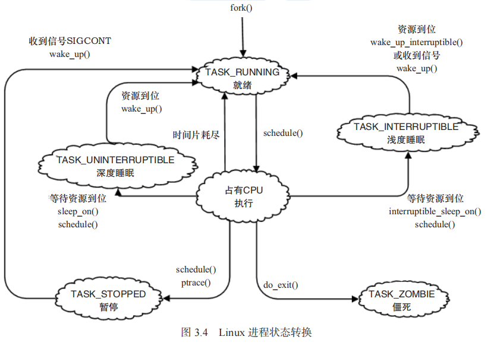

# Linux 设备驱动开发详解
基于最新的 Linux 4.0 内核-宋宝华

如未作特殊说明，笔记中的图均来自书本。
## 第三章-Linux 内核及内核编程
### Linux 2.6 后的内核特点
Linux 2.6 相对于 Linux 2.4 有相当大的改进，主要体现在如下几个方面：
1. 新的调度器
   - 使用**新的进程调度算法**，它在高负载的情况下有极其出色的性能，并且当有很多处理器时也可以很好地扩展。
     - Linux 2.6 早期采用 `O(1)` 算法，之后采用 `CFS` (Completely Fair Scheduler, 完成公平调度) 算法。
     - 在 Linux 3.14 中，增加了一个新的调度类：`SCHED_DEADLIEN`，它实现了 `EDF` (Earliest Deadline First, 最早截止期限优先) 调度算法。
2. 内核抢占
   - 在 Linux 2.6 以后版本的 Linux 内核中，**一个内核任务可以被抢占**，从而提高系统的实时性。
   - Linux 2.6 以后的内核版本**还是存在一些不可抢占的区间，如中断上下文、软中断上下文和自旋锁锁住的区间**，这是 Linux 内核本身只提供**软实时**能力的原因。
   - 如果给 Linux 内核打上 **RT-Preempt 补丁，则中断和软中断都被线程化了，自旋锁也被互斥体替换**，Linux 内核变得能支持**硬实时**。
     
     - 图中左边部分 RT 任务需要等到系统调用结束后才能运行，右边部分在不可抢占区间（中断上下文，IRQ1 和 IRQ 2）结束后便抢占系统调用（内核任务）来运行 RT 任务。
3. 改进的线程模型
   - Linux 2.6 以后版本中的线程采用 `NPTL` (Native POSIX Thread Library, 本地 POSIX 线程库) 模型，操作速度得以极大提高。
   - Linux 2.4 内核使用 LinuxThreads 模型。
   - `NPTL` 没有使用 LinuxThreads 模型中采用的管理线程，内核本身也增加了 `FUTEX` (Fast Userspace Mutex, 快速用户态互斥体)，从减少多线程的通信开销。
4. 虚拟内存的变化
   - 融合了 r-map (反向映射) 技术（通过页结构体快速找到页面的映射），显著改善虚拟内存在一定大小负载下的性能。
5. 文件系统
   - 增加对日志文件系统功能的支持。
   - ...
6. 音频
   - 高级 Linux 音频体系结构（Advanced Linux Sound Architecture, `ALSA`）取代了缺陷很多旧的 OSS (Open Sound System)。
7. 总线、设备和驱动模型
   - 总线是三者联系起来的基础，通过一种总线类型，将设备和驱动联系起来。
8. 电源管理
   - 支持高级配置和电源接口（Advanced Configuration and Power Interface, `ACPI`），用于调整 CPU 在不同的负载下工作于不同的时钟频率以降低功耗。
   - 电源管理（PM）也相对完善，包括 CPUFreq、CPUIlde、CPU 热插拔、设备运行时（runtime）PM、Linux 系统挂起到内存和挂起到硬盘等全套的支持，在 ARM 上的支持也比较完善。
     - [ ] Linux 系统挂起到内存和挂起到硬盘？
9. 联网和 IPSec
   - 加入 NFSv4 客户机/服务器的支持。
10. 用户界面层
    - 重写帧缓冲/控制台层。
    - 人机界面层加入对近乎所有接口设备的支持，从触摸屏到盲人用的设备和各种各样的鼠标。
    - 设备驱动方面，内核 API 中增加不少新功能（如内存池）、sysfs 文件系统、内核模块从 `.o` 到 `.ko`、驱动模块编译方式、模块使用计数、模块加载和卸载函数的定义等。
11. Linux 3.0 后 ARM 架构的变更
    - 加入对 `FDT` (Flattened Device Tree) 的支持。
    - 在时钟、DMA、pinmux、计时器刻度等方面进行优化和调整。
    - 删除 `arch/arm/mach-xxx/include/mach` 头文件目录，以至于 Linux 3.7 以后的内核可以支持多平台，即同一份内核镜像运行多家 SoC 公司的多个芯片，实现“一个 Linux 可适用于所有的 ARM 系统”。

### 内核源码目录结构
1. `arch`：
  和硬件体系结构相关的代码，每种平台占一个相应的目录。在该目录下，存放的是各平台以及各平台芯片对 Linux 内核进程调度、内存管理、中断等的支持，以及每个具体的 SoC 和电路板的板级支持代码。
2. `include`：
   - 和系统相关的头文件放置在 `include/linux` 子目录下。
   - 内核 API 级别头文件。
3. `init`：
  内核初始化代码。**著名的 `start_kernel()` 就位于 `init/main.c` 中**。
4. `kernel`：
  内核最核心的部分，包括进程调度、定时器等，而和平台相关的一部分代码放在 `arch/xxx/kernel` 目录下。
5. `sound`：
  `ALSA`、`OSS` 音频设备的驱动核心代码和常用设备驱动。
6. `usr`：
  实现用于打包和压缩的 `cpio` 等。
7. `ipc`：
  进程间通信的代码。

**内核一般要做到 drivers 与 arch 的软件架构分离，驱动中不包含板级信息，让驱动跨平台。同时内核的通用部分（如 kernel、fs、ipc、net 等）则与具体的硬件（arch 和 drivers）剥离**。

### 内核的组成部分
Linux 内核主要由进程调度（`SCHED`）、内存管理（`MM`）、虚拟文件系统（`VFS`）、网络接口（`NET`）和进程间通信（`IPC`）5 个子系统组成。

1. 进程调度
   - 内核中的其他子系统都依赖它，因为每个子系统都需要挂起或恢复进程。
   - 在设备驱动编程中，当请求的资源不能得到满足时，驱动一般会调度其他进程执行，并使本进程进入睡眠状态，直到它请求的资源得到满足，才会被唤醒而进入就绪状态。
   - 可中断和不可中断睡眠的区别在于，前者在收到信号的时候会醒。
    

## 第四章-Linux 内核模块
### 模块特点
- 模块本身不被编译进内核映像，从而控制了内核的大小；
- 模块一旦被加载，它就和内核中的其他部分完全一样。

### 模块的安装和卸载
```bash
#安装
insmod ./hello.ko
modprobe filename       # 同时加载依赖
#卸载
rmmod hello
modprobe -r filename    # 同时卸载依赖
```
- 模块之间的依赖关系存在在根文件系统的 `/lib/modules/<kernel-version>/modules.dep` 文件中，实际上是在整体编译内核的时候由 `depmod` 工具生成的；

### 模块信息查看
```bash
# 获得系统中已加载的所有模块以及模块间的依赖关系
lsmod
# 也可直接查看文件：
cat /proc/modules
# 在 sys 下也存在对应的入口
cd /sys/module/hello
tree -a
# 查看模块的作者、说明、支持的参数等：
modinfo <模块名>
```
- `lsmod` 本质上是读取并分析 `/proc/modules` 文件。

### 模块程序结构
1. 模块加载函数
2. 模块卸载函数
3. 模块许可证声明
4. 模块参数（可选）
5. 模块导出符号（可选）
6. 模块作者等信息声明（可选）

### 模块加载函数
- 一般以 `__init` 标识声明，以 `module_init(函数名)` 的形式被指定；
- 返回整型值，成功-0；失败-错误编码，一个接近于 0 的负值；
- 可以使用 `request_module(const char *fmt, ...)` 函数加载模块，驱动开发人员可以通过调用下列代码：
    ```c
    request_module(module_name);
    ```
    灵活地加载其他内核模块。
- 所有被标识为 `__init` 的函数如果直接编译进内核，在链接的时候都会放在 `.init.text` 这个区段内：
    ```c
    #define __init      __attribute__((__section__(".init.text")))
    ```
    所有 `__init` 函数在区段 `.initcall.init` 中还保存了一份函数指针，在初始化时内核会通过这些函数指针调用这些 `__init` 函数，并**在初始化完成后，释放 init 区段（包括 `.init.text`、`.initcall.init` 等）的内存**。
- 数据也可以被定义为 `__initdata`，对于只是初始化阶段需要的数据，内核在初始化完成后，也可以释放它们占用的内存：
    ```c
    // 声明 hello_data 为 __initdata
    static int hello_data __initdata = 1;
    ```

### 模块卸载函数
- 一般以 `__exit` 标识声明，不返回任何值，且必须以 `module_exit(函数名)` 的形式来指定；
- 通常来说，模块卸载函数需要完成与模块加载函数相反的功能；
- 通过 `__exit` 修饰的卸载函数，如果模块被编译进内核，则卸载函数会被忽略，直接不链接进最后的映像（编译进内核->无法卸载->卸载函数无存在必要）；
- 退出阶段的数据也可以使用 `__exitdata` 来修饰。

### 模块参数
- 可以用 `module_param(参数名, 参数类型, 参数读/写权限)` 为模块定义一个参数：
    ```c
    // 字符指针参数
    static char *book_name = "dissecting Linux Device Driver";
    module_param(book_name, charp, S_IRUGO);
    ```
- 参数类型可以是：byte, short, ushort, int, uint, long, ulong, charp (字符指针), bool 或 invbool (布尔的反)；
- 也可以使用 `module_param_array(数组名, 数组类型, 数组长, 参数读/写权限)` 定义参数数组，运行 `insmod/modprobe` 命令时，应使用逗号分隔输入的数组元素；
- 在装载内核模块时，用户可以向模块传递参数，形式为：`insmod/modprobe 模块名 参数名=参数值`；如果不传递，则使用模块内定义的缺省值；如果模块被内置，bootloader 可以通过在 bootargs 里设置 `模块名.参数名=值` 的形式给该内置模块传递参数；
- 当参数读写权限不为 0 时，在 `/sys/module/模块名` 目录下将出现 `parameters` 子目录，其中包含一系列以参数名命名的文件节点，可以使用 `cat` 命令查看相应的参数值（如有读权限）。

### 导出符号
- `/proc/kallsyms` 文件对应着内核符号表，它记录了符号以及符号所在的内存地址；
    ```bash
    # 从 /proc/kallsyms 文件中找出 add_integar、sub_integar 的相关信息
    grep integar /proc/kallsyms
    ```
- 模块使用如下宏将符号导出到内核符号表中：
    ```c
    EXPORT_SYMBOL(符号名)
    EXPORT_SYMBOL_GPL(符号名)
    ```

### 模块声明与描述
相关宏：
- `MODULE_AUTHOR`
- `MODULE_DESCRIPTION`
- `MODULE_VERSION`
- `MODULE_DEVICE_TABLE`
- `MODULE_ALIAS`

### 模块使用计数
- Linux 2.4，模块自身使用 `MOD_INC_USE_COUNT` 和 `MOD_DEC_USE_COUNT` 宏来管理自己被使用的计数；
- Linux 2.6 以后的内核提供了模块计数管理接口：
  - `int try_module_get(struct module *module)`：0-调用失败，希望使用的模块没有被加载或正在被卸载中；
  - `void module_put(struct module *module)`。
- 模块的使用计数一般不必由模块自身管理，而且模块计数管理还考虑了 SMP 和 PREEMPT 机制的影响；
- Linux 2.6 以后的内核为不同类型的设备定义了 `struct module *owner` 域，用来指向管理此设备的模块。当开始使用某个设备时，内核使用 `try_module_get(dev->owner)` 去增加管理此设备的 owner 模块的使用计数；当不再使用此设备时，内核使用 `module_put(dev->owner)` 减少使用计数。这样，当设备在使用时，管理此设备的模块将不能被卸载。只有当设备不再被使用时，模块才允许被卸载；
- 对设备 owner 模块的计数管理由内核里更底层的代码（如总线驱动或是此类设备共用的核心模块）来实现，从而简化了设备驱动开发。 

### 模块的编译
```Makefile
KVERS = $(shell uname -r)
#Kernel modules
obj-m += hello.o
#Specify flags for the module compilation
#EXTRA_CFLAGS=-g -O0

build: kernel_modules

kernel_modules:
    make -C /lib/modules/$(KVERS)/build M=$(CURDIR) modules

clane:
    make -C /lib/modules/$(KVERS)/build M=$(CURDIR) clean
```

### 使用模块“绕开” GPL
一般认为，保守的做法是 Linux 内核不能使用非 GPL 许可权。

## 第五章-Linux 文件系统与设备文件
由于字符设备和块设备都良好地体现了“一切都是”文件地设计思想，掌握 **Linux 文件系统、设备文件系统**的知识就显得相当重要了。

首先，驱动最终通过与文件操作相关的系统调用或 C 库函数（本质也基于系统调用）被访问，而**设备驱动的结构最终也是为了迎合提供给应用程序员的 API**。

其次，驱动工程师在设备驱动中**不可避免地会与设备文件系统打交道，包括从 Linux 2.4 内核的 devfs 文件系统到 Linux 2.6 以后的 udev**。

### Linux 文件操作
1. 创建
    ```c
    int creat(const char *filename, mode_t mode);
    ```
    - **`mode` 指定新建文件的存取权限，它同 `umask` 一起决定文件的最终权限（`mode & umask`）**。
    - `umask` 代表了文件在创建时需要去掉的一些存取权限，可通过系统调用 `umask()` 来改变，它只影响读、写和执行权限。
        ```c
        // 返回旧 的 umask
        int umask(int newmask);

        // 获取当前的 umask
        int get_current_umask() {
            int cur_umask = umask(0);
            umask(cur_umask);
            return cur_umask;
        }
        ```
2. 打开
    ```c
    int open(const char *pathname, int flags);
    int open(const char *pathname, int flags, mode_t mode);
    ```
    - `flags`：`O_EXEC`，如果使用了 `O_CREAT` 而且文件已经存在，就会发生一个错误。`O_RDONLY, O_WRONLY, O_RDWR` 只能使用其中一个。其他 flag 略。
    - [ ] c 支持重载吗？如果不支持又是如何实现的两个 open 函数的定义？
    - 如果使用了 `O_CREAT` 标志，则使用的函数是 `int open(const char *pathname, int flags, mode_t mode)`，这个时候还需指定 mode 标志，以表示文件的访问权限：
        ```c
        S_IRUSR // 用户权限
        S_IWUSR
        S_IXUSR
        S_IRWXU
        S_IRGRP // 组权限
        S_IWGRP
        S_IXGRP
        S_IRWXG
        S_IROTH // 其他人权限
        S_IWOTH
        S_IXOTH
        S_IRWXO
        S_ISUID // 设置用户执行 ID
        S_ISGID // 设置组的执行 ID
        ```
        - 也可以用数字来表示标志。Linux 用 5 个数字来表示文件的各种权限：第一位表示设置用户 ID、第二位表示设置组 ID、第三位表示用户权限、第四位表示组权限、第五位表示其他人权限。每个数字可以取 1（执行权限）、2（写权限）、4（读权限）、0（无）或这些值的和。
   - 以 `O_CREAT` 为标志的 open 实际上实现了文件创建的功能，因此，下面的函数等用于 `creat()` 函数：
        ```c
        int open(pathname, O_CREAT | O_WRONLY | O_TRUNC, mode);
        ```
3. 读写
    ```c
    // 返回读取到的字节数量
    int read(int fd, void *buf, size_t length);
    // 返回写入的字节数量
    int write(int fd, const void *buf, size_t length);
    ```
4. 定位
    ```c
    // 返回文件指针相对于文件头的位置
    int lseek(int fd, offset_t offset, int whence);
    ```
    - `whence`：`SEEK_SET`-相对文件开头、`SEEK_CUR`-相对文件读写指针的当前位置、`SEEK_END`-相对文件末尾；
    - `offset` 可以取负值；
    - 返回文件长度：`lseek(fd, 0, SEEK_END)`。
5. 关闭
    ```c
    int close(int fd);
    ```
-----
C 库文件操作
1. 创建和打开
    ```c
    FILE *fopen(const char *path, const char *mode);
    ```
    - `mode`：
      - `r`、`rb`：以只读方式打开；
      - `w`、`wb`：以只写方式打开。如果文件不存在，则创建该文件，否则文件被截断。
      - `a`、`ab`：以追加方式打开。如果文件不存在，则创建该文件。
      - `r+`、`r+b`、`rb+`：以读写方式打开。
      - `w+`、`w+b`、`wh+`：以读写方式打开。如果文件不存在，创建新文件，否则文件被截断。
      - `a+`、`a+b`、`ab+`：以读和追加方式打开。如果文件不存在，则创建新文件。
      - 其中，`b` 用于区分二进制文件和文本文件，但在 Linux 中不区分二进制文件和文本文件。
2. 读写：
    ```c
    int fgetc(FILE *stream);
    int fputc(int c, FILE *stream);
    char *fgets(char *s, int n, FILE *stream);
    int fputs(const char *s, FILE *stream);
    int fprintf(FILE *stream, const char *format, ...);
    int fscanf(FILE *stream, const char *format, ...);
    size_t fread(void *ptr, size_t size, size_t n, FILE *stream);
    size_t fwrite(const void *ptr, size_t size, size_t n, FILE *stream);
    ```
    - `fread()` 实现从流（stream）中读取 n 个字段，每个字段为 size 字节，并将读取的字段放入 ptr 所指的字符数组中，返回实际已读取的字段数。当读取字段小于 n 时，可能是在函数调用时出现了错误，也可能是读到了文件末尾。因此要通过调用 `feof()` 和 `ferror()` 来判断。
3. 定位
    ```c
    int fgetpos(FILE *stream, fpos_t *pos);
    int fsetpos(FILE *stream, const fpos_t *pos);
    int fseek(FILE *stream, long offset, int whence);
    ```
4. 关闭
    ```c
    int fclose(FILE *stream);
    ```

### Linux 文件系统目录结构
1. `bin`
2. `sbin`
3. `dev`
4. `etc`：busybox 的启动脚本也存放在该目录。
5. `lib`
6. `mnt`：`/etc/fstab`。
7. `opt`：有些软件包会被安装在这里。
8. `proc`
9. `temp`
10. `usr`：系统存放程序的目录，比如用户命令、用户等。
11. `var`：`/var/log` 目录被用来存放系统日志。
12. `sys`：Linux 2.6 以后的内核所支持的 sysfs 文件系统被映射在此目录上。

### Linux 文件系统与设备驱动
- [ ] 文件系统与设备驱动之间的关系
- **应用程序和 VFS 之间的接口是系统调用，而 VFS 与文件系统以及设备文件之间的接口是 `file_operations` 结构体成员函数**。
- [ ] 应用程序、VFS 与设备驱动
- **由于字符设备的上层没有类似于磁盘的 ext2 等文件系统，所以字符设备的 `file_operations` 成员函数就直接由设备驱动提供了**。
- 块设备有两种访问方法：
  - **不通过文件系统直接访问裸设备**，在 Linux 内核实现了统一的 `def_blk_fops` 这一 `file_operations`，它的源码位于 `fs/block_dev.c`。所以当运行类似于 `dd if=/dev/sdb1 of=sdb1.img` 的命令将整个 `/dev/sdb1` 裸分区复制到 sdb1.img 的时候，内核走的是 def_blk_fops 这个 file_operations；
  - **通过文件系统访问块设备**，`file_operations` 的实现则位于文件系统内，文件系统会把针对文件的读写转换为针对块设备原始扇区的读写。ext2、fat、Btrfs 等文件系统中会实现针对 VFS 的 file_operations 成员函数，设备驱动层将看不到 file_operations 的存在。
- `struct file`
  - 代表一个代开的文件；
  - **它由内核在打开文件时创建，并传递给在文件上进行操作的任何函数**；
  - 在文件的所有实例都关闭后，内核释放这个数据结构；
  - 在内核和驱动源码中，struct file 的指针通过被命名为 file 或 filp (file pointer)。
  - [ ] 数据结构定义
  - `f_flags`：文件标志，如 `O_RDONLY, O_NONBLOCK, O_SYNC`；
  - `f_mode`：文件读/写模式，`FMODE_READ` 和 `FMODE_WRITE`；
  - **文件读/写模式 `f_mode`、标志 `f_flags` 都是设备驱动关心的内容，而私有数据指针 `private_data` 在设备驱动中被广泛应用，大多被指向设备驱动自定义以用于描述设备的结构体**。
- `struct inode`
  - VFS inode 包含文件访问权限、属主、组、大小、生成时间、访问时间、最后修改时间等信息；
  - 是 Linux 管理文件系统的最基本单位，也是文件系统连接任何子目录、文件的桥梁；
  - [ ] 数据结构定义
  - 从一个 inode 中获取主设备号和此设备号
    ```c
    unsigned int iminor(struct inode *inode);
    unsigned int imajor(struct inode *inode);
    ```
  - 查看 `/proc/devices` 文件可获知系统中注册的设备和主设备号 + 设备名信息；
  - 查看 `/dev` 目录可获知系统中包含的设备文件，日期前两列对应设备的主设备号和此设备号；
  - **主设备号是与驱动对应的概念，同一类设备一般使用相同的主设备号。因为同一驱动可支持多个同类设备，因此使用次设备号来描述使用该驱动的设备的序号**，序号一般从 0 开始；
  - 内核 Documents 目录下的 devices.txt 文件描述了 Linux 设备号的分配情况，它由 [LANANA](http://www.lanana.org/) 组织维护。

### devfs
devfs (设备文件系统) 是由 Linux 2.4 内核引入的，其他略。

### udev 用户空间设备管理
1. udev 与 devfs 的区别
   - devfs 所作的工作被确信可以在用户态完成。Linux 设计中强调机制和策略分离，机制相对固定，而策略倾向于变化，在 Linux 内核中不应该实现策略。
   - udev 完全工作在用户态，利用设备加入或移除时内核所发送的热插拔事件（Hotplug Event）来工作；devfs 工作在内核态，通过程序在设备初始化时在 `/dev` 目录下创建设备文件，设备卸载时将它删除；
   - udev 的设备命名策略、权限控制和事件处理都是在用户态下完成的，它利用从内核收到的信息来进行创建设备文件节点工作；
   - 在热插拔时，设备的详细信息会由内核通过 netlink 套接字发送出来，发出的事情叫 uevent；
   - 对于冷插拔的设备，它们在开机时就存在，在 udev 启动前已经被插入了。对于此种情况，Linux 内核提供了 sysfs 下面一个 uevent 节点，可以往该节点写入一个 "add"，导致内核重新发送 netlink，之后 udev 就可以收到冷插拔的 netlink 消息了；
   - 另一个显著区别是：采用 devfs，当一个并不存在的 /dev 节点被打开时，devfs 能自动加载对应的驱动，而 udev 则不这么做。这是因为 udev 设计者认为 Linux 应该在设备被发现的时候加载驱动模块，而不是当它被访问的时候；
   - netlink 使用范例（从内核通过 netlink 接收热插拔事件并冲刷掉的范例）：
        ```c
        #include <linux/netlink.h>

        static void die(char *) {
            write(2, s, strlen(s));
            exit(1);
        }

        int main(int argc, char *argv[]) {
            struct sockaddr_nl nls;
            struct pollfd pfd;
            char buf[512];

            // open hotplug event netlink socket
            memset(&nls, 0, sizeof(struct sockaddr_nl));
            nls.nl_family = AF_NETLINK;
            nls.nl_pid = getpid();
            nls.nl_groups = -1;

            pfd.events = POLLIN;
            pfd.fd = socket(PF_NETLINK, SOCK_DGRAM, NETLINK_KOBJECT_UEVENT);
            if (pfd.fd == -1)
                die("Not root\n");
            
            // Listen to netlink socket
            if (bind(pfd.fd, (void*)&nls, sizeof(struct sockaddr_nl)))
                die("Bind failed\n");
            while (-1 != poll(&pfd, 1, -1)) {
                int i, len = recv(pfd.fd, buf, sizeof(buf), MSG_DONTWAIT);
                if (len == -1)
                    die("recv\n");
                // print the data to sdtou
                i = 0;
                while (i < len) {
                    printf("%s\n", buf + i);
                    i += strlen(buf + i) + 1;
                }
            }
            die("poll\n");
            // Dear gcc: shut up
            return 0;
        }
        ```
2. sysfs 文件系统与 Linux 设备模型
   - 可以产生一个包括所有系统硬件的层级视图，与提供进程和状态信息的 proc 文件系统十分类似；
   - sysfs 的一个目的就是展示设备驱动模型中各个组件的层次关系；
   - 在 `/sys/bus` 的 pci 等子目录下，又会再分出 drivers 和 devices 目录，而 devices 目录中的文件是对 `/sys/devices` 目录中文件的符号链接。同样的，`/sys/class` 目录下也包含许多对 `/sys/devices` 下文件的链接；
   - Linux 设备模型与设备、驱动、总线和类的现实状况是直接对应的：
     - [ ] Linux 设备模型
     - [ ] Linux 驱动模型中设备、总线和类的关系
   - 大多数情况下，内核中的设备驱动核心层代码作为“幕后大佬”可处理好这些关系，内核中的总线和其他内核子系统会完成与设备模型的交互，这使得驱动工程师在编写底层代码时几乎不需要关心设备模型，只需要按照每个框架的要求，“填鸭式”地填充 xxx_driver 里面的各种回调函数，xxx 是总线的名字；
   - 总线、驱动和设备最终都会落实为 sysfs 中的一个目录，因为进一步追踪代码会发现，它们实际上都可以认为是 kobject 的派生类，kobject 可以看作是所有总线、设备和驱动的抽象基类，1 个 kobject 对应 sysfs 中的 1 个子目录；目录中的文件来源于 attribute；
   - 脚本，遍历整个 sysfs，并且 dump 出总线、设备和驱动信息。`mknod` 那一行还可以为整个系统中的设备建立 `/dev` 下的节点：
        ```shell
        #!/bin/bash
        #Populate block devices
        for i in /sys/block/*/dev /sys/block/*/*/dev
        do
            if [ -f $i ]
            then
                MAJOR=$(sed 's/:.*//' < $i)
                MINOR=$(sed 's/.*://' < $i)
                DEVNAME=$(echo $i | sed -e 's@/dev/@@' -e 's@.*/@@')
                echo /dev/$DEVNAME b $MAJOR $MINOR
                #mknod /dev/$DEVNAME b $MAJOR $MINOR
            fi
        done

        #Populate char devices
        for i in /sys/bus/*/devices/*/dev /sys/class/*/*/dev
        do
            if [ -f $i ]
            then
                MAJOR=$(sed 's/:.*//' < $i)
                MINOR=$(sed 's/.*://' < $i)
                DEVNAME=$(echo $i | sed -e 's@/dev/@@' -e 's@.*/@@')
                echo /dev/$DEVNAME c $MAJOR $MINOR
                #mknod /dev/$DEVNAME c $MAJOR $MINOR
            fi
        done
        ```
3. udev 组成
   - udev 目前和 systemd 项目合并在一起了；
   - udev 在用户空间中执行，动态建立、删除设备文件，允许每个人都不用关心主/次设备号而提供 LSB (Linux 标准规范，Linux Standard Base) 名称，并且可以根据需要固定名称；
   - 工作过程：
     - 当内核检测到系统中出现了新设备后，内核会通过 netlink 套接字发送 uevent；
     - udev 获取内核发送的信息，进行规则匹配。
4. udev 规则文件
   - 规则文件以行为单位，以 "#" 开头的行代表注释行，其余每一行代表一个规则；
   - 每个规则分为匹配部分和赋值部分；
   - 匹配关键字包括：`ACTION`、`KERNEL` (匹配内核设备名)、`BUS`、`SUBSYSTEM`、`ATTR` 等；
   - 赋值关键字包括：`NAME` (创建的设备文件名)、`SYMLINK` (符号创建链接名)、`OWNER`、`GROUP`、`IMPORT` (调用的外部程序)、`MODE` (节点访问权限) 等。
   - 在匹配部分可以使用通配符，此外，`%k` 就是 `KERNEL`，`%n` 就是设备的 KERNEL 序号（如存储设备的分区号）；
   - 规则文件位置（来自 kimi 问答）：
---
udev/mdev 规则文件的位置取决于你使用的是哪个设备管理器（udev 还是 mdev），以及系统配置。

---

## 一、udev 规则文件位置

udev 是大多数现代 Linux 发行版（Ubuntu、Debian、Fedora、RHEL 等）使用的设备管理器。

### 标准路径

| 路径 | 优先级 | 说明 |
|------|--------|------|
| `/etc/udev/rules.d/` | **最高** | 系统管理员自定义规则，覆盖系统默认规则 |
| `/usr/lib/udev/rules.d/` | 中 | 发行版/软件包安装的规则 |
| `/lib/udev/rules.d/` | 中 | 旧版系统兼容路径（通常软链接到 `/usr/lib/udev/rules.d/`） |
| `/run/udev/rules.d/` | 次高 | 运行时生成的规则（临时，重启消失） |

### 规则文件加载顺序

```
1. 按文件名数字前缀排序（如 50-udev-default.rules 在 60-persistent-storage.rules 之前）
2. 同数字前缀时，/etc/udev/rules.d/ 优先于 /lib/udev/rules.d/
3. 后加载的规则可以覆盖先加载的规则
```

### 常用命令

```bash
# 查看当前生效的规则文件
ls -la /etc/udev/rules.d/ /lib/udev/rules.d/ /usr/lib/udev/rules.d/

# 重新加载规则（不重启 udevd）
sudo udevadm control --reload-rules

# 触发特定设备的 uevent
sudo udevadm trigger --action=change /dev/sda

# 测试规则匹配
sudo udevadm test $(udevadm info -q path -n /dev/sda)
```

---

## 二、mdev 规则文件位置

mdev 是 BusyBox 提供的轻量级设备管理器，常用于嵌入式系统（OpenWrt、Buildroot 等）。

| 路径 | 说明 |
|------|------|
| `/etc/mdev.conf` | **主配置文件** |
| `/lib/mdev/` 或 `/usr/lib/mdev/` | 辅助脚本 |

### `/etc/mdev.conf` 格式示例

```bash
# 设备名正则  用户:组  权限  [-> 别名]  [命令]
sd[a-z][0-9]  0:0  660  */lib/mdev/usb_hook
hd[a-z][0-9]  0:0  660
ttyUSB[0-9]   0:0  660  @/lib/mdev/ttyusb_hook
```

---

## 三、快速判断系统使用哪个

```bash
# 查看 udev 是否运行
ps aux | grep udevd

# 查看 mdev 是否运行
ps aux | grep mdev

# 或查看 /sbin/udevadm 是否存在
which udevadm

# 查看 BusyBox 是否提供 mdev
busybox mdev --help 2>/dev/null
```

---

## 四、总结

| 设备管理器 | 规则文件路径 |
|-----------|-------------|
| **udev**（桌面/服务器） | `/etc/udev/rules.d/*.rules`（自定义）<br>`/usr/lib/udev/rules.d/*.rules`（系统默认） |
| **mdev**（嵌入式） | `/etc/mdev.conf` |

如果你是在做嵌入式 Linux 开发（如 i.MX6ULL），通常使用 **mdev**，规则文件就是 `/etc/mdev.conf`。如果是标准 Linux 发行版，使用 **udev**，规则在 `/etc/udev/rules.d/` 下。

另一个问答：
如果嵌入式系统中没有 `/etc/mdev.conf`，mdev 仍然可以工作，因为它有**内置的默认规则**。让我解释：

---

## 一、mdev 的默认行为

mdev 是 BusyBox 的一部分，其源码（`busybox/util-linux/mdev.c`）中硬编码了默认规则：

```c
// busybox/util-linux/mdev.c 简化逻辑

static void make_device(char *path, int delete)
{
    // 1. 读取 /sys 路径中的设备信息
    // 2. 如果没有 /etc/mdev.conf，使用默认规则：
    //    - 块设备：mode=0660, uid=0, gid=0
    //    - 字符设备：mode=0660, uid=0, gid=0
    //    - 根据设备类型自动创建节点
    
    // 默认命名规则：
    // - 使用 /sys/class/xxx/yyy/dev 中的设备号
    // - 设备名取自 sysfs 中的 devname 或路径名
}
```

---

## 二、默认规则的具体内容

### 设备节点权限默认值

| 设备类型 | 默认权限 | 默认用户/组 |
|----------|----------|-------------|
| 块设备 (block) | `0660` | `root:root` |
| 字符设备 (char) | `0660` | `root:root` |

### 设备名来源

mdev 按以下优先级确定设备名：

```
1. /sys/.../dev 文件中的设备号
2. /sys/.../uevent 中的 DEVNAME 变量
3. sysfs 路径中的设备目录名
4. 内核通过 netlink 发送的 uevent 信息
```

---

## 三、为什么能正常工作

```
内核检测到设备插入
    ↓
内核发送 uevent（通过 netlink socket）
    ↓
mdev 监听 netlink（mdev -s 或 mdev daemon 模式）
    ↓
mdev 读取 /sys/class/xxx/yyy/ 下的设备信息
    ↓
mdev 检查 /etc/mdev.conf
    ↓
├─ 存在 → 按配置文件规则处理（权限、脚本、别名）
│
└─ 不存在 → 使用内置默认规则创建 /dev/ 节点
              (mknod, 权限 0660, root:root)
```

---

## 四、验证方法

```bash
# 查看 mdev 是否运行
ps | grep mdev

# 查看 mdev 启动方式（通常是 init 脚本）
cat /etc/inittab | grep mdev
# 或
cat /etc/init.d/S10mdev

# 典型启动方式：
# mdev -s          # 扫描 /sys 并创建所有设备节点（启动时）
# echo /sbin/mdev > /proc/sys/kernel/hotplug  # 设置内核热插拔代理
```

---

## 五、如果需要自定义规则

即使没有默认的 `/etc/mdev.conf`，你也可以手动创建：

```bash
# 创建 mdev 配置文件
cat > /etc/mdev.conf << 'EOF'
# 设备名正则    用户:组   权限   [命令]
sd[a-z][0-9]    0:0      660    */lib/mdev/usb_storage
ttyS[0-9]       0:0      660
input/event[0-9] 0:0     640
EOF

# 创建辅助脚本目录
mkdir -p /lib/mdev

# 重新触发设备创建
mdev -s
```

---

## 六、总结

| 问题 | 答案 |
|------|------|
| 没有 `/etc/mdev.conf` 时 mdev 怎么工作 | 使用 **BusyBox 源码中硬编码的默认规则** |
| 默认权限是什么 | 块/字符设备都是 `0660 root:root` |
| 设备名从哪里来 | `/sys` 文件系统中的 `devname`、`uevent` 或目录名 |
| 如何自定义 | 创建 `/etc/mdev.conf` 和辅助脚本 |
| 与 udev 的区别 | udev 必须有规则文件，mdev 有内置回退 |

所以你的根文件系统即使没有 `/etc/mdev.conf`，mdev 也能正常工作，只是所有设备都使用默认的 `0660` 权限。
---
   - 示例：
        ```txt
        SUBSYSTEM=="net", ACTION=="add", DRIVERS=="?*", ATTR{address}=="08:00:27:35:be:ff", ATTR{dev_id}=="0x0", ATTR{type}=="1", KERNEL=="eth*", NAME="eth1"
        // 这个规则的意思是：当系统中出现的新硬件属于 net 子系统范畴
        // 系统对该硬件采取的动作是 "add" 这个硬件，且这个硬件的 "address" 属性值等于 "08:00:27:35:be:ff"，"dev_id" 属性值等于 "0x0"，
        // "type" 属性为 1 等，此时，对这个硬件在 uevent 层次实施的动作是
        // 创建 /dev/eth1。
        ```
   - 可以借助 udev 中的 `udevadm info` 工具查找规则文件能够利用的内核信息和 sysfs 属性信息，如 `udevadm info -a -p /sys/devices/platform/serial8250/tty/ttyS0`；
   - 如果 `/dev/` 下面的节点已经被创建，但不知道它对应的 `/sys` 具体节点路径，可以采用 `udevadm info -a -p $(udevadm info -p path -n /dev/<节点名>)` 命令反向分析；
   - 在嵌入式系统中，也可以用 udev 的轻量级版本 mdev，mdev 集成于 busybox 中。在编译 busybox 时选中 mdev 相关项目即可；
   - Android 采用的是 vold，vold 的机制和 udev 是一样的。Android 的源代码 NetlinkManager.cpp 同样是监听基于 netlink 的套接字，并解析收到的消息。

### 总结
Linux 用户空间的文件编程有两种方法，即通过 Linux API 和通过 C 库函数访问文件。用户空间看不到设备驱动，能看到的只有与设备对应的文件，因此文件编程也就是用户空间的设备编程。

Linux 按照功能对文件系统的目录结构进行了良好的规划。`/dev` 是设备文件的存放目录，devfs 和 udev 分别是 Linux 2.4 和 Linux 2.6 以后的内核生成设备文件节点的方法，前者运行于内核空间，后者运行于用户空间。

Linux 2.6 以后的内核通过一系列数据结构定义了设备模型，设备模型与 sysfs 文件系统中的目录和文件存在一种对应关系。设备和驱动分离，并通过总线进行匹配。

udev 可以利用内核通过 netlink 发出的 uevent 信息动态创建设备节点文件。

## 第六章 字符设备驱动
### Linux 字符设备驱动结构
1. `cdev` 结构体
   - 结构体定义：
        ```c
        struct cdev {
            struct kobject kobj;            /* 内嵌的 kobject 对象 */
            struct module *owner;           /* 所属模块 */
            struct file_operations *ops;    /* 文件操作结构体 */
            struct list_head list;
            dev_t dev;                      /* 设备号 */
            unsigned int count;
        }
        ```
   - 设备号相关：主设备号 12 位，次设备号 20 位；相关操作宏（`MAJOR, MINOR, MKDEV`）
   - cdev 结构体的另一个重要成员 **file_operations 定义了字符设备驱动提供给虚拟文件系统的接口函数**。
   - 操作 cdev 结构体的函数：
     - `void cdev_init(struct cdev *, struct file_operations *)`：初始化 cdev 的成员，并建立 cdev 与 file_operations 之间的连接，源码：
        ```c
        void cdev_init(struct cdev *cdev, struct file_operations *fops) {
            memset(cdev, 0, sizeof(*cdev));
            INIT_LIST_HEAD(&cdev->list);
            kobject_init(&cdev->kobj, &ktype_cdev_default);
            cdev->ops = fops;
        }
        ```
     - `struct cdev *cdev_alloc(void)`：动态申请一个 cdev 内存：
        ```c
        struct cdev *cdev_alloc(void) {
            struct cdev *p = kzalloc(sizeof(struct cdev), GFP_KERNEL);
            if (p) {
                INIT_LIST_HEAD(&p->list);
                kobject_init(&p->kobj, &ktype_cdev_dynamic);
            }
            return p;
        }
        ```
     - `void cdev_put(struct cdev *p)`
     - `int cdev_add(struct cdev *p, dev_t, unsigned)`：向系统添加一个 cdev，完成**字符设备的注册**。对它的调用通常发生在字符设备驱动模块加载函数中。
     - `void cdev_del(struct cdev *)`：从系统中删除一个 cdev，完成**字符设备的注销**。对它的调用通常发生在字符设备驱动模块卸载函数中。
2. 分配和释放设备号
   - `int register_chrdev_region(dev_t from, unsigned count, const char *name);`
   - `int alloc_chrdev_region(dev_t *dev, unsigned baseminor, unsigned count, const char *name);`
   - `void unregister_chrdev_region(dev_t from, unsigned count);`
3. file_operations 结构体
   - file_operations 结构体定义，略。
   - `llseek()` 函数用来修改一个文件的当前读写位置，并将新位置返回，在出错时，这个函数返回一个负值。
   - `read()` 函数用来从设备中读取数据，成功时函数返回读取的字节数，出错时返回一个负值。
   - `write()` 函数向设备发送数据，成功时该函数返回写入的字节数。如果此函数未被实现，当用户进行 `write()` 系统调用时，将得到 `-EINVAL` 返回值。
   - **`read()` 和 `write()` 如果返回 0，则暗示 end-of-file (`EOF`)**。
   - `unlocked_ioctl()` 提供设备相关控制命令的实现，当调用成功时，返回给调用程序一个非负值。它与用户空间的 `int fcntl(int fd, int cmd, .../* arg */)` 和 `int ioctl(int d, int request, ...)` 对应。
   - `mmap()` 函数**将设备内存映射到进程的虚拟地址空间中**，如果设备驱动未实现此函数，用户进行 `mmap()` 系统调用时将获得 `-ENODEV` 返回值。无须在内核和应用间进行内存复制。它与用户空间的 `void mmap(void *addr, size_t length, int prot, int flags, int fd, off_t offset)` 对应。
   - `open()` **如果驱动程序不实现此函数，则设备的打开操作永远成功**。与 `open()` 对应的是 `release()` 函数。
   - `poll()` 函数一般用于询问设备是否可以被非阻塞地立即读写。当询问的条件未触发时，用户空间进行 `select()` 和 `poll()` 系统调用将引起进程的阻塞。
   - `aio_read()` 和 `aio_write()` 函数分别对与文件描述符对应的设备进行异步读、异步写操作。设备实现这两个函数后，用户空间可以对该设备文件描述符执行 `SYS_io_setup`、`SYS_io_submit`、`SYS_io_getevents`、`SYS_io_destroy` 等系统调用进行读写。
4. Linux 字符设备驱动的组成
   - 字符设备驱动模块加载与卸载函数
     - 编码习惯是为设备定义一个设备相关的结构体，该结构体包含设备所涉及的 cdev、私有数据及锁等信息；
   - 字符设备驱动的 file_operations 结构体中的成员函数
     - 是字符设备驱动与虚拟文件系统的接口，系统调用的最终落实者；
     - `copy_from_user`、`copy_to_user`；
     - `put_user`、`get_user`；
     - `__user`，宏，表明其后的指针指向用户空间，实际上更多地充当了代码自注释的功能；
     - 判断用户空间缓冲区的合法性：`access_ok(type, addr, size)`。在内核空间与用户空间的界面处，内核检查用户空间缓冲区的合法性显得尤其必要；
     - I/O 控制函数的 cmd 参数为事先定义的 I/O 控制命令，而 arg 为对应于该命令的参数；
     - [ ] 图，字符设备驱动的结构

### globalmem 设备驱动
1. 头文件、宏及设备结构体
2. 加载与卸载设备驱动
3. 读写函数
   - 到达文件末尾，返回 0（`EOF`）。
4. seek 函数
   - `SEEK_SET, 0`、`SEEK_CUR, 1`、`SEEK_END, 2`；
   - 检查用户请求的合法性，若不合法，返回 `-EINVAL`；合法时更新文件的当前位置并返回该位置；
5. ioctl 函数
   - 统一的 `ioctl()` 命令生成方式；
   - 设备类型，8 位，幻数，0~0xff，内核中的 `ioctl-number.txt` 给出了一些推荐的和已经被使用的幻数；
   - 序列号，8 位；
   - 方向，2 位；`_IOC_NONE, _IOC_READ, _IOC_WRITE, _IOC_READ | _IOC_WRITE`；**数据传送方向是从应用程序的角度来看的**；
   - 数据尺寸，13/14 位；
   - 辅助命令生成的宏：`_IO(), _IOR(), _IOW(), _IOWR()`；
   - 预定义命令：略。
6. 使用文件私有数据
   - 实际上，大多数 Linux 驱动遵循着一个“潜规则”，那就是将文件的私有数据 private_data 指向设备结构体，再用 `read()`、`write()`、`ioctl()`、`llseek()` 等函数通过 `private_data` 访问设备结构体。
   - `container_of()`：
        ```c
        static int globalmem_open(struct inode *inode, struct file *file) {
            struct globalmem_dev *dev = container_of(inode->i_cdev, struct globalmem_dev, cdev);
            file->private_data = dev;
            return 0;
        }
        ```
        - [ ] 通过 `cdev_init/cdev_add` 操作后将 cdev 赋值给了 inode？或者它们之间是什么时候建立的联系？

### 总结
字符设备其驱动程序完成的主要工作是初始化、添加和删除 cdev 结构体，申请和释放设备号，以及填充 file_operations 结构体中的操作函数，实现 file_operations 结构体中的函数是驱动设计的主体工作。

## 第十八章-ARM Linux 设备树
### 设备树的组成和结构
1. 参考硬件的设备树文件（part） 
    ```dts
    / {
        compatible = "acme,coyotes-revenge";
        #address-cells = <1>;
        #size-cells = <1>;
        interrupt-parent = <&intc>;

        ...

        external-bus {
            #address-cells = <2>;
            #size-cells = <1>;
            ranged = <0 0 0x10100000 0x10000        // chipselect 1, Ethernet
                      1 0 0x10160000 0x10000        // chipselect 2, i2c controller
                      2 0 0x30000000 0x4000000>;    // chipselect 3, NOR Flash
            
            ethernet@0, 0 {
                compatible = "smc,smc91c111";
                reg = <0 0 0x10000>;
                interrupts = <5 2>;
            };

            i2c@1, 0 {
                compatible = "acme,a1234-i2c-bus";
                #address-cells = <1>;
                #size-cells = <0>;
                reg = <1 0 0x10000>;
                interrupts = <6 2>;
                rtc@58 {
                    compatible = "maxim,ds1338";
                    reg = <0x58>;
                    interrupts = <7 3>;
                };
            };

            flash@2, 0 {
                compatible = "samsung,k8f1315ebm", "cfi-flash";
                reg = <2 0 0x4000000>;
            };
        };
    };
    ```
    - 根节点下的默认中断控制器是 `intc`，`intc` 也是根节点下的子节点；
    - [ ] 外部总线与本地总线间的转换、`ranges` 属性的解析、external-bus 下的子节点在 "@" 也使用两个 cell...

## 第十九章-Linux 电源管理的系统架构和驱动
### Linux 电源管理的全局架构
- Linux 电源管理牵扯到系统级的待机、频率电压变换、系统空闲时的处理以及每个设备驱动对系统待机的支持和每个设备的运行时（Runtime）电源管理，可以说它和系统中的每个设备驱动都息息相关；
- 对于消费电子产品来说，电源管理的工作在开发周期中占比相当大；
- [ ] 图，Linux 内核电源管理的整体架构
  - CPU 在运行时根据系统负载进行动态电压和频率的变换-CPUFreq
  - CPU 在系统空闲时根据空闲的情况进行低功耗模式-CPUIdle
  - 多核系统下 CPU 的热插拔支持；
  - 系统和设备针对延迟的特别需求而提出申请的 PM QoS (Power Management Quality of Service，表示 Linux 内核电源管理的质量)，它会作用于 CPUIdle 的具体策略；
  - 设备驱动针对系统挂起到 RAM/硬盘的一系列入口函数；
  - SoC 进入挂起状态、SDRAM 自刷新的入口；
  - 设备的运行时动态电源管理，根据使用情况动态开关设备；
  - 底层的时钟、稳压器、频率/电压表（OPP 模块完成）支撑，各驱动子系统都可能用到；

### CPUFreq 驱动
- 位于 `drivers/cpufreq` 目录下
  - 核心层：`drivers/cpufreq/cpufreq.c`，提供各个 SoC 的 CPUFreq 驱动的同一接口、实现 notifier 机制（可在 CPUFreq 的策略和频率改变时向其他模块发出通知）；
- 负责进行运行过程中 CPU 频率和电压的动态调整，即 DVFS, Dynamic Voltage Frequency Scaling，动态电压频率调整；
- 降低电压和频率可降低功耗；
- CPU 运行频率发生变化时，内核的 `loops_per_jiffy` 常数也会发生相应变化；

1. SoC 的 CPUFreq 驱动实现
   - 只需实现电压、频率表，以及从硬件层面完成这些变化；
   - 驱动注册接口：
    ```c
    int cpufreq_register_driver(struct cpufreq_driver *driver_data);

    struct cpufreq_driver {
      ...
    };
    ```
    - flags 是一些暗示性标志，如设置了 `CPUFREQ_CONST_LOOPS` 则告诉内核 `loops_per_jiffy` 不会因为 CPU 频率的变化而变化；
    - init 回调是一个 per-CPU 初始化函数指针，每当一个新的 CPU 被注册进系统时，该函数就被调用。该函数还接受一个 `cpufreq_policy` 的指针参数。在该函数中可以设置 policy 允许的最小、最大频率（单位 Hz）、CPU 进行频率切换所需的延迟（单位 ns）和当前 CPU 频率等；
    - verify 回调验证用户的 CPUFreq 策略设置有效性和数据修正，每当用户设定新策略时，该函数根据老策略和新策略，检验新策略设置的有效性并对无效设置进行必要的修正；常用到如下辅助函数：
      ```c
      cpufreq_verify_within_limits(struct cpufreq_policy *policy, unsigned int min_freq, unsigned int max_freq);
      ```
    - setpolicy 回调，实现了该函数的 CPU 一般具备在一个范围里自动调整频率的能力；目前只有少数驱动包含这样的成员函数，而绝大多数 CPU 都不会实现此函数，一般只实现 target 回调；
    - target 回调，用于将频率调整到一个指定的值；
    - [ ] 表，setpolicy 和 target 所针对的 CPU 及其调用方式上的区别
   - 根据芯片内部 PLL 和分频器的关系，ARM SoC 一般不具备独立调整频率的能力，往往 SoC 的 CPUFreq 驱动会提供一个频率表，频率在该表的范围内进行变更，因此一般实现 target 回调；
   - CPUFreq 核心层提供一组与频率表相关的辅助 API
    ```c
    // init 回调的助手，用于将 policy->min 和 policy->max 设置为
    // 与 cpuinfo.min_freq 和 cpuinfo.max_freq 相同的值
    int cpufreq_frequency_table_cpuinfo(struct cpufreq_policy *policy, struct cpufreq_frequency_table *table);

    // verify 回调的助手，确保至少有 1 个有效的 CPU 频率位于 policy->min
    // 到 policy->max 的范围内
    int cpufreq_frequency_table_verify(struct cpufreq_policy *policy, struct cpufreq_frequency_table *table);

    // target 回调的助手，返回需要设定的频率在频率表中的索引
    int cpufreq_frequency_table_target(struct cpufreq_policy *policy,
      struct cpufreq_frequency_table *table,
      unsigned int target_freq,
      unsigned int relation,
      unsigned int *index);
    ```
   - 示例程序：`drivers/cpufreq/s3c64xx-cpufreq.c`，具体代码略；
   - 关于频率表，比较新的内核喜欢使用后面介绍的 OPP。

2. CPUFreq 的策略
  - SoC CPUFreq 驱动只是设定了 CPU 的频率参数，以及提供了设置频率的途径，但是它并不会管 CPU 自身究竟应该运行在哪种频率上，这些完全由 CPUFreq 的策略（policy）决定；
  - CPUFreq 的策略：
    - `cpufreq_ondemand`：平时以低速方式运行，当系统负载提高时按需自动提高频率；
    - `cpufreq_performance`：以最高频率运行，即 `scaling_max_freq`
    - `cpufreq_conservative`：传统的、保守的，跟 ondemand 相似，区别在于动态频率在变更的时候采用渐进的方式；
    - `cpufreq_powersave`：以最低频率运行，即 `scaling_min_freq`；
    - `cpufreq_userspace`：让用户通过 sys 节点 scaling_setspeed 设置频率
  - 系统的状态和 CPUFreq 的策略共同决定了 CPU 频率跳变的目标，CPUFreq 核心层并将目标频率传递给底层具体 SoC 的 CPUFreq 驱动，该驱动修改硬件，完成频率的变换：
    - [ ] 图，CPUFreq、系统负载、策略与调频
  - 用户空间一般可以 `/sys/devices/system/cpu/cpux/cpufreq` 节点来设置 CPUFreq：
    ```c
    echo userspace > /sys/devices/system/cpu/cpu0/cpufreq/scaling_governor
    echo 700000 > /sys/devices/system/cpu/cpu0/cpufreq/scaling_setspeed
    ```

3. CPUFreq 的性能测试与调优
   - cpupower-utils，位于 `tools/power/cpupower`，其中的 cpufreq-bench 工具可以用于分析采用 CPUFreq 后对系统性能的影响；
   - 一般目标是在采用 CPUFreq 动态调整频率和电压后，性能应该为 performance 这个高性能策略下的 90％ 左右，这样才比较理想。

4. CPUFreq 通知
   - CPUFreq 子系统发出通知的两种情况：
     - CPUFreq 的策略变化
     - CPU 运行频率变化
   - 在策略变化的过程中，会发送 3 次通知：
     - `CPUFREQ_ADJUST`
     - `CPUFREQ_INCOMPATIBLE`
     - `CPUFREQ_NOTIFY`
   - 在频率变化的过程中，会发送 2 次通知：
     - `CPUFREQ_PRECHANGE`
     - `CPUFREQ_POSTCHANGE`
     - 发送示例：
      ```c
      // freqs 为 cpufreq_freqs 的结构体，包含 cpu (CPU 号)、old（过去的频率）和 new（现在的频率）
      srcu_notifier_call_chain(&cpufreq_transition_notifier_list, CPUFREQ_PRECHANGE, freqs);
      srcu_notifier_call_chain(&cpufreq_transition_notifier_list, CPUFREQ_POSTCHANGE, freqs);
      ```
   - 注册 notifier 示例：`drivers/video/sa1100fb.c`，接口：`cpufreq_register_notifier(...)`；
   - 如果在系统挂起/恢复过程中 CPU 频率发生了变化，则 CPUFreq 子系统也会发出 `CPUFREQ_SUSPENDCHANGE` 和 `CPUFREQ_RESUMECHANGE` 这两个通知；
   - 除了 CPU 以外，一些设备也支持操作频率和电压，存在多个 OPP。Linux 3.2 以后的内核也支持针对这种非 CPU 设备的 DVFS，该套子系统为 Devfreq，位置：`drivers/devfreq`。

### CPUIdle 驱动
- ARM SoC 大多支持几个不同的 Idle 级别，CPUIdle 驱动子系统存在的目的就是对这些 Idle 状态进行管理，并根据系统的运行情况进入不同的 Idle 级别。
- 具体 SoC 的底层 CPUIdle 驱动实现则提供一个类似于 CPUFreq 驱动频率表的 Idle 级别表，并实现各种不同 Idle 状态的进入和退出流程。
- Intel，支持 ACPI，Advanced Configuration and Power Interface，一般有 4 个不同的 C 状态（C0-操作状态、C1-Halt 状态、C2-Stop-clock 状态、C3-Sleep 状态）。
- ARM SoC 对 Idle 的实现方法差异比较大，最简单的 Idle 级别莫过于将 CPU 核置于 WFI (等待中断发生) 状态，因此在默认情况下，若 SoC 未实现自身的芯片级 CPUIdle 驱动，则会进入 `cpu_do_idle()`。对于 ARMv7 而言，其实现位于 `arch/arm/mm/proc-v7.S`:
  ```asm
  ENTRY(cpu_v7_do_idle)
  dsb                     @ WFI may enter a low-power mode
  wfi
  mov pc, lr
  ENDPROC(cpu_v7_do_idle)
  ```
- 注册 API：
  ```c
  int cpuidle_register_driver(struct cpuidle_driver *drv);
  int cpuidle_register_device(struct cpuidle_device *dev);

  struct cpuidle_driver {
    ...
  }

  struct cpuidle_state {
    ...
  }
  ```
  - CPUIdle 驱动必须针对每个 CPU 注册相应的 cpuidle_device，这意味着对于多核 CPU 而言，需要针对每个 CPU 注册依次；
- 驱动示例：`arch/arm/mach-ux500/cpuidle.c`/`drivers/cpuidle/cpuidle-ux500.c`，它有两个 Idle 级别，WFI 和 ApIdle。
- governor：
  - `CPU_IDLE_GOV_LADDER`：在进入和退出 Idle 级别时是步进的，它以过去的 Idle 时间作为参考，适用于没有采用动态时间节拍的系统（没有选择 `NO_HZ`）；
  - `CPU_IDLE_GOV_MENU`：总是根据预期的空闲时间直接进入目标 Idle 级别，依赖于内核的 `NO_HZ` 选项；
- 在 sys 导出的节点
  - 针对整个系统的 `/sys/devices/system/cpu/cpuidle`，通过其中的 `current_driver, current_governor, available_governors` 等节点获取或设置 CPUIdle 的驱动信息以及 governor；
  - 针对每个 CPU 的 `sys/devices/system/cpu/cpux/cpuidle`，通过子节点暴露各个在线的 CPU 中每个不同 Idle 级别的 name、desc、power、latency 等信息；
- [ ] 图，Linux CPUIdle 子系统的整体框架

### PowerTop
- 一款开源的用于进行电量消耗分析和电源管理诊断的工具

### Regulator 驱动
- Regulator 是 Linux 系统中电源管理的基础设施之一，用于稳压电源的管理，是各种驱动子系统中设置电源的标准接口。
- Regulator 可以管理系统中的供电单元，即稳压器（LDO, Low Dropout Regulator，即低压差线性稳压器），并提供获取和设置这些供电单元电源的接口。
- 一般在 ARM 电路板上，各个稳压器和设备会形成一个 Regulator 树形结构：
  - [ ] 图，Regulator 树形结构
- 注册和注销接口：
  ```c
  struct regulator_dev *regulator_register(const struct regulator_desc *regulator_desc, const struct regulator_config *config);

  void regulator_unregister(struct regulator_dev *rdev);

  // regulator_dev 对稳压器属性和操作的封装
  struct regulator_dev {
    ...
  }
  // regulator_ops 对稳压器硬件操作的封装
  struct regulator_ops {
    ...
  }
  ```
- 在 `drivers/regulator` 下，包含大量的 regulator 驱动，同时提供了一个虚拟的 regulator 驱动作为参考；
- Regulator 子系统提供 Consumer API：
  ```c
  struct regulator *regulator_get(struct device *dev, const char *id);
  struct regulator *devm_regulator_get(struct device *dev, const char *id);
  struct regulator *regulator_get_exclusive(struct device *dev, const char *id);
  void regulator_put(struct regulator *regulator);
  void devm_regulator_put(struct regulator *regulator);
  int regulator_enable(struct regulator *regulator);
  int regulator_disable(struct regulator *regulator);
  int regulator_set_voltage(struct regulator *regulator, int min_uV, int max_uV);
  int regulator_get_voltage(struct regulator *regulator);
  ```

### OPP
- 在 SoC 内，某些 domain 可以运行在较低的频率和电压下，而其他 domain 可以运行在较高的频率和电压下，某个 domain 所支持的 <频率，电压> 对的集合被称为 Operating Performance Point，简称 OPP。
- 针对与 device 结构体指针 dev 对应的 domain 中增加一个新的 OPP：
  ```c
  int opp_add(struct device *dev, unsigned long freq, unsigned long u_volt);
  ```
- 使能和禁止某个 OPP：
  ```c
  int opp_enable(struct device *dev, unsigned long freq);
  int opp_disable(struct device *dev, unsigend long freq);
  ```
  - 一旦被禁止，其 available 将成为 false
- 寻找一个确定频率和 available 匹配的 OPP：
  ```c
  struct opp *opp_find_freq_exact(struct device *dev, unsigned long freq, bool available);
  // 变体-频率向下接近或等于指定的频率
  struct opp *opp_find_freq_floor(struct device *dev, unsigned long *freq);
  // 变体-频率向上接近或等于指定的频率
  struct opp *opp_find_freq_ceil(struct device *dev, unsigned long *freq);
  ```
- 在频率降低的同时，支持该频率运行所需的电压也往往可以动态调低；反之同理：
  ```c
  // 获取与某 opp 对应的电压和频率
  unsigned long opp_get_voltage(struct opp *opp);
  unsigned long opp_get_freq(struct opp *opp);

  // 示例：
  soc_switch_to_freq_voltage(freq) {
    // do things
    rcu_read_lock();
    opp = opp_find_freq_ceil(dev, &freq);
    v = opp_get_voltage(opp);
    rcu_read_unlock();
    if (v)
      regulator_set_voltage(..., v);
    // do other things
  }
  ```
- 获取设备所支持的 OPP 的个数：
  ```c
  int opp_get_opp_count(struct device *dev);
  ```
- TI OMAP CPUFreq 驱动的底层就使用了 OPP 这种机制来获取 CPU 所支持的频率和电压列表。在开机过程中，TI OMAP4 芯片会注册针对 CPU 设备的 OPP 表（`arch/arm/mach-omap2/` 中）。
  - 在 `omap_init_opp_table()` 中添加了相应的 OPP；
  - 在 TI OMAP 芯片的 CPUFreq 驱动 `drivers/cpufreq/omap-cpufreq.c` 中，借助 `opp_init_cpufreq_table()` 并根据前面注册的 OPP 建立 CPUFreq 的频率表；
  - 在 CPUFreq 的 target 回调函数实现 `omap_target()` 中使用与 OPP 相关的 API 来获取频率和电压；
- 比较新的驱动一般不太喜欢直接在代码里面固化 OPP 表，而是喜欢在相应的节点处添加 `operating-points` 属性，如 `imx27.dtsi` 中：
  ```c
  cpus {
    #size-cells = <0>;
    #address-cells = <1>;

    cpu: @cpu0 {
      device_type = "cpu";
      compatible = "arm,arm926ej-s";
      operating-points = <
        /* KHz uv */
        266000 1300000
        399000 1450000
      >;
      clock-latency = <62500>;
      clocks = <&clks, IMX27_CLK_CPU_DIV>;
      voltage-tolerance = <5>;
    };
  };
  ```
- 如果 CPUFreq 的变化可以使用非常标准的 regulator、clk API，我们甚至可以直接使用 `drivers/cpufreq/cpufreq-dt.c` 这个驱动。这样只需要在 CPU 节点上填充好频率电压表，然后在平台代码里面注册 cpufreq-dt 设备就可以了。在 `arch/arm/mach-imx/imx27-dt.c`、`arch/arm/mach-imx/mach-imx51.c` 中可以找到类似的例子：
  ```c
  static void __init imx27_dt_init(void) {
    struct platform_device_info devinfo = {
      .name = "cpufreq-dt",
    };
    of_platform_populate(NULL, of_default_bus_match_table, NULL, NULL);
    platform_device_register_full(&devinfo);
  }
  ```

### PM QoS
- Linux 内核的 PM QoS 系统针对内核和应用程序提供了一套接口，通过这个接口，用户可以设定自身对性能的期望。
  - 一类是系统级的需求，通过 `cpu_dma_latency`、`network_latency` 和 `network_throughput` 这些参数来设定；
  - 另一类是单个设备可以根据自身的性能需求发起 `per-device` 的 PM QoS 请求。
- PM QoS 接口：
  ```c
  // 注册请求
  void pm_qos_add_request(struct pm_qos_request *req, int pm_qos_class, s32 value);
  // 更新已注册的请求
  void pm_qos_update_request(struct pm_qos_request *req, s32 new_value);
  void pm_qos_update_request_timeout(struct pm_qos_request *req, s32 new_value, unsigned long timeout_us);
  // 删除已注册的请求
  void pm_qos_remove_request(struct pm_qos_request *req);
  ```
- 示例：在 `/drivers/media/platform/via-camera.c` 这个摄像头驱动中：
  ```c
  // 当摄像头开启后，通过如下方式阻止 CPU 进入 C3 级别深度的 Idle：
  static int viacam_streamon(struct file *filp, void *priv, enum v4l2_buf_type t) {
    ...
    pm_qos_add_request(&cam->qos_request, PM_QOS_CPU_DMA_LATENCY, 50);
  }

  // 当摄像头关闭后，取消对 PM_QOS_CPU_DMA_LATENCY 的性能要求
  static int viacam_streamon(struct file *filp, void *priv, enum v4l2_buf_type t) {
    ...
    pm_qos_remove_request(&cam->qos_request);
    ...
  }
  ```
  - 类似的在设备驱动中申请 QoS 特性的例子还包括：`drivers/net/wireless/ipw2x00/ipw2100.c`、`drivers/tty/serial/omap-serial.c`、`drivers/net/ethernet/intel/e1000e/netdev.c` 等；
  - 在 CPUIdle 子系统中，会根据 `PM_QOS_CPU_DMA_LATENCY` 请求情况选择合适的 C 状态；
  - `drivers/cpuidle/governors/ladder.c` 中的 `ladder_select_state()` 会判断目标 C 状态的 `exit_latency` 与 QoS 要求的关系，具体代码略。LADDER 在选择是否进入更深层次的 C 状态时，会比较 C 状态的 exit_latency 要小于通过 `pm_qos_request(PM_QOS_CPU_DMA_LATENCY)` 得到的 PM QoS 请求的延迟。同样的逻辑也出现在 `drivers/cpuidle/governors/menu.c` 中。
- 应用程序则可以通过向 `/dev/cpu_dma_latency` 和 `/dev/network_latency` 这样的设备节点写入值来发起 QoS 的性能请求。

### CPU 热插拔
- Linux 3.8 之后的内核 CPU0 也可以热插拔；
- 一般地，在用户空间可以通过 `/sys/devices/system/cpu/cpun/online` 节点来操作一个 CPU 的在线和离线：
  ```bash
  # xxx -> 离线
  echo 0 > /sys/devices/system/cpu/cpu3/online
  # xxx -> 在线
  echo 1 > /sys/devices/system/cpu/cpu3/online
  ```
- 在 CPU 离线时，该 CPU 上的进程都会被迁移到其他 CPU 上，以保证拔除该 CPU 的过程中，系统仍然能正常运行。当 CPU 再次在线时，又可以参与系统的负载均衡，分担系统中的任务。
- 在嵌入式系统中，CPU 热插拔可以作为一种省电的方式。在系统负载小时，动态关闭 CPU，当负载增大后再开启之前离线的 CPU。
- 目前各个芯片公司可能会根据自身 SoC 的特点，对内核进行调整，来实现运行时“热插拔”。
- 关于运行时热插拔的示例，Tegra3 vSMP，5 个 Cortex-A9 处理器，其中 4 个为高性能 G 核，1 个 为低功耗 LP 核，具体示例略。
- 目前，ARM 和 Linux 社区都在从事关于 big.LITTLE 架构下，CPU 热插拔以及调度器方面有针对性的改进工作。在 big.LITTLE 架构中，将高性能且功耗也较高的 Cortex-A15 和稍低性能且功耗低的 Cortex-A7 进行了结合，或者在 64 位下，进行 Cortex-A57 和 Cortex-A53 的组合：
  - [ ] 图，ARM 的 big.LITTLE 架构
- big.LITTLE 架构的设计旨在为适当的作业分配恰当的处理器。Cortex-A15 处理器是目前已开发的性能最高的低功耗 ARM 处理器，而 Cortex-A7 处理器是目前已开发的最节能的 ARM 应用程序处理器。可以利用 Cortex-A15 处理器的性能来承担繁重的工作负载，而用 Cortex-A7 可以最有效地处理智能手机的大部分工作负载，包括操作系统活动、用户界面和其他持续运行、始终连接的任务。

### 挂起到 RAM
- Linux 支持 STANDBY、挂起到 RAM、挂起到硬盘等形式的待机；
  - [ ] 图，Linux 的待机模式
  - 挂起到 RAM：即将系统的状态保存于内存中，并将 SDRAM 置于自刷新状态，待用户按键等操作后再重新恢复系统；
  - 挂起到硬盘：简称 STD，与挂起到 RAM 不同的是，后者并不关机，STD 则把系统的状态保持于磁盘，然后关闭整个系统。
- 一般的嵌入式产品仅仅只实现了挂起到 RAM，简称 s2ram 或 STR；
- 在 Linux 下，这些行为通常是由用户空间触发的，通过向 `/sys/power/state` 写入 `mem` 可开始挂起到 RAM 的流程。许多 Linux 产品会有一个按键，通过按键挂起到 RAM，这通常是由于与这个按键对应的输入设备驱动汇报了一个和电源相关的 input_event，用户空间的电源管理 daemon 进程收到这个事件后，再触发 s2ram。
- 内核也有一个 INPUT_APMPOWER 驱动，位于 `drivers/input/apm-power.c` 下，它可以在内核级别侦听 `EV_PWR` 类事件，并通过 `apm_queue_event(APM_USER_SUSPEND)` 自动引发 s2ram：
  ```c
  static void system_power_event(unsigned ing keycode) {
    switch (keycode) {
    case KEY_SUSPEND:
      amp_queue_event(APM_USER_SUSPEND);
      pr_info("Requesting system suspend...\n");
      break;
    default:
      break;
    }
  }

  static void apmpower_event(struct input_handle *handle, unsigned int type, unsigned int code, int value) {
    ...
    switch (type) {
    case EV_PWR:
      system_power_event(code);
      break;
    ...
    }
  }
  ```
- 在 Linux 内核中，挂起到 RAM 的挂起和恢复流程牵涉的操作包括同步文件系统、freeze 进程、设备驱动挂起以及系统的挂起入口：
  - [ ] 图，Linux 挂起到 RAM 流程
- 在 Linux 内核的 device_driver 结构中，含有一个 pm 成员，它是一个 dev_pm_ops 结构体指针，在该结构体中，封装了挂起到 RAM 和挂起到硬盘所需的回调函数。`struct dev_pm_ops` 定义略。
  - 目前比较推荐的做法是在 platform_driver、i2c_driver 和 spi_driver 等 xxx_driver 结构体实例的 driver 成员中，通过 `dev_pm_ops` 封装 PM 回调函数，并赋值到 driver 的 pm 字段。如 `drivers/spi/spi-s3c64xx.c` 中 `platform_driver` 的 `pm` 成员被赋值，具体代码略。`s3c64xx_spi_suspend()` 完成了时钟的禁止、`s3c64xx_spi_resume()` 则完成了硬件的重新初始化、时钟的使能等工作。
- 在 platform_driver、i2c_driver、spi_driver 等 xxx_driver 结构体中仍然保留了过程（legacy）的 suspend、resume 入口函数，目前不再推荐使用过时的接口，而是推荐赋值 xxx_driver 中的 driver 的 pm 成员；
  - 在 Linux 的核心层中，实际上是优先选择执行 `xxx_driver.driver.pm.suspend()`，当接口不存在时，执行 `xxx_driver.suspend()`，如 `platform_pm_suspend()`：
    ```c
    int platform_pm_suspend(struct device *dev) {
      struct device_driver *drv = dev->driver;
      int ret = 0;

      if (!drv)
        return 0;
      
      if (drv->pm) {
        if (drv->pm->suspend)
          ret = drv->pm->suspend(dev);
      } else {
        ret = platform_legacy_suspend(dev, PMSG_SUSPEND);
      }
      return ret;
    }
    ```
  - [ ] xxx_driver 和 driver 以及 device 的 pm 操作的作用、联系和区别
- 一般来讲，在设备驱动的挂起入口函数中，会关闭设备、关闭该设备的时钟输入，甚至是关闭设备的电源，在恢复时完成相反的操作。
- 在挂起到 RAM 的挂起和恢复过程中，系统恢复后要求所有设备的驱动都工作正常。为了调试这个过程，可以使能内存的 `PM_DEBUG` 选项，如果想在挂起和恢复过程中，看到内核的打印信息，可以在 Bootloader 传递给内核的 bootargs 中设置标志 no_console_suspend。
- 在将 Linux 移植到一个新的 ARM SoC 的过程中，最终系统挂起的入口需由芯片供应商在相应的 `arch/arm/mach-xxx` 中实现 `platform_suspend_ops` 的成员函数，一般主要实现其中的 enter 和 valid 成员，并将整个 platform_suspend_ops 结构体通过内核通用 API `suspend_set_ops()` 注册进系统，如 `arch/arm/mach-prima2/pm.c` 中 prima2 SoC 级挂起流程，代码略。

### 运行时的 PM
- 在 `dev_pm_ops` 结构体中，以 `runtime` 开头的成员函数：`runtime_suspend()`、`runtime_resume()`、`runtime_idle()`，它们辅助设备完成运行时的电源管理。
- 运行时的 PM 与系统级挂起到 RAM 时的 PM 不太一样，它是针对单个设备，指系统在非睡眠状态下的情况，某个设备在空闲时可以进入运行时挂起状态，而在不是空闲时执行运行时恢复使得设备进入正常工作状态。如此，达到运行时省电的目的。
- 相关 API：
  ```c
  // 引发设备的挂起，执行相关的 runtime_suspend 函数
  int pm_runtime_suspend(struct device *dev);
  // “调度”设备的挂起，延迟 delay ms 后将挂起工作挂入 pm_wq 等待队列
  // 结果等价于 delay ms 后执行相关的 runtime_suspend()
  int pm_schedule_suspend(struct device *dev, unsigned int delay);
  // “调度”设备的挂起，自动挂起的延迟到后，挂起的工作项目被自动放入队列
  int pm_request_autosuspend(struct device *dev);
  // 引发设备的恢复，执行相关的 runtime_resume() 函数
  int pm_runtime_resume(struct device *dev);
  // 发起一个设备恢复的请求，该请求也是挂入 pm_wq 等待队列
  int pm_request_resume(struct device *dev);
  // 引发设备的空闲，执行相关的 runtime_idle() 函数
  int pm_runtime_idle(struct device *dev);
  // 发起一个设备空闲的请求，该请求也是挂入 pm_wq 等待队列
  int pm_request_idle(struct device *dev);
  // 使能设备的运行时 PM 支持
  void pm_runtime_enable(struct device *dev);
  // 禁止设备的运行时 PM 支持
  int pm_runtime_disable(struct device *dev);
  // 增加设备的引用计数（usage_count），类似于 clk_get()，会间接引发设备的 runtime_resume()
  int pm_runtime_get(struct device *dev);
  int pm_runtime_get_sync(struct device *dev);
  // ... clk_put，... runtime_idle()
  int pm_runtime_put(struct device *dev);
  int pm_runtime_put_sync(struct device *dev);
  ```
- 对 Linux 运行时 PM 机制的简单理解：每个设备（总线的控制器自身也是设备）都有引用计数 usage_count 和活跃子设备（Active Children）计数 child_count，当两个计数都为 0 时，就进入空闲状态，调用 `pm_request_ilde(dev)`。当设备进入空闲状态，与 `pm_request_idle(dev)` 对应的 PM 核并不一定直接调用设备驱动的 `runtime_suspend()`，它实际上在多数情况下是调用与该设备对应的 `bus_type` 的 `runtime_suspend()`：
  ```c
  static pm_callback_t __rmp_get_callback(struct device *dev, size_t cb_offset) {
    pm_callback_t cb;
    const struct dev_pm_ops *ops;

    if (dev->pm_domain)
      ops = &dev->pm_domain->ops;
    else if (dev->type && dev->type->pm)
      ops = dev->type->pm;
    else if (dev->class && dev->class->pm)
      ops = dev->class->pm;
    else if (dev->bus && dev->bus->pm)
      ops = dev->bus->pm;
    else
      ops = NULL;
    
    if (ops)
      cb = *(pm_callback_t*)((void*)dev->driver->pm + cb_offset);
    return cb; 
  }
  ```
  - bus_type 级的回调函数实际上可以被 pm_domain、type、class 覆盖掉，这些都统称为子系统；
  - bus_type 等子系统级别的 runtime_idle() 行为完全由相应的总线类型、设备分类和 pm_domain 因素决定，但是一般的行为是子系统级别的 runtime_idle() 会调度设备驱动的 runtime_suspend()。
- 在具体的设备驱动中，一般用法是在设备驱动 `probe()` 时运行 `pm_runtime_enable()` 使能运行时 PM 支持，在运行过程中动态地执行 `pm_runtime_get_xxx()->do work -> pm_runtime_put_xxx()` 的序列。示例代码：`/drivers/watchdog/omap_wdt.c-omap_wdt_start(), omap_wdt_stop()`。
- 在某些设备驱动中，直接使用引用计数的方法进行挂起、空闲和恢复不一定合适，因为挂起状态的进入和恢复需要一些时间，如果设备不在挂起之间保留一定的时间，频繁进出挂起反而会带来新的开销。因此，可根据实际情况决定只有设备在空闲了一段时间后才进入挂起（一般来说，一个一段时间没有被使用的设备，还会有一段时间不会被使用）。基于此，一些设备驱动也常常使用自动挂起模式进行编程。
  - 在执行操作的声明 `pm_runtime_get()`，操作完成后执行 `pm_runtime_mark_last_busy()` 和 `pm_runtime_put_autosuspend()`，一旦自动挂起的延时到期且设备的使用计数为 0，则引发相关的 `runtime_suspend()` 入口函数的调用：
    ```c
    foo_read_or_write(struct foo_priv *foo, void *data) {
      lock(&foo->private_lock);
      add_request_to_io_queue(foo, data);
      if (foo->num_pending_request++ == 0)
        pm_runtime_get(&foo->dev);
      if (!foo->is_suspend)
        foo_process_next_request(foo);
      unlock(&foo->private_lock);
    }

    foo_io_completion(struct foo_priv *foo, void *req) {
      lock(&foo->private_lock);
      if (--foo->num_pending_request == 0) {
        pm_runtime_mark_last_busy(&foo->dev);
        pm_runtime_put_autosuspend(&foo->dev);
      } else {
        foo_process_next_request(foo);
      }
      unlock(&foo->private_lock);
      // 将请求结果返回给用户...
    }
    ```
  - [ ] 挂起和空闲的区别是什么，为什么上述在 ilde 时要调用 suspend，是不是书本错误？
- 设备驱动 PM 成员的 `runtime_suspend()` 一般完成保存上下文、切到省电模式的工作，而 `runtime_resume()` 一般完成对硬件上电、恢复上下文的工作。示例程序：`drivers/spi/spi-p1022.c`。

## 第二十章 Linux 芯片级移植及底层驱动
### ARM Linux 底层驱动的组成和现状
- 为了让 Linux 在一个全新的 ARM SoC上运行，需要提供大量的底层支撑，如定时器节拍、中断控制器、SMP 启动、CPU 热插拔以及底层的 GPIO、时钟、pinctrl 和 DMA 硬件的封装等。
  - 定时器节拍 Linux 基于时间片的调度机制以及内核和用户的定时器提供支持；
  - 中断控制器的驱动允许 local_irq_disable()、disable_irq() 等通用的中断 API 的调用；
  - SMP 启动支持则用于让 SoC 内部的多个 CPU 核都投入运行；
  - CPU 热插拔则用于运行时挂载或拔出 CPU。
- 对 GPIO、时钟、pinctrl 和 DMA 驱动方面的工作（Linux 2.6 后，2011 年后）：
  - STEricsson 公司，新的 pinctrl 驱动框架，新增 /drivers/pinctrl 内核目录，支撑 SoC 上的引脚复用，各个 SoC 的实现代码统一放入该目录；
  - TI 公司，通用时钟框架，让具体 SoC 实现 clk_ops() 成员函数，并通过 clk_register()、clk_register_clkdev() 注册时钟源以及源与设备的对应关系，具体的时钟驱动都统一迁到 drivers/clk 目录中；
  - 建议各 SoC 统一采用 dmaengine 架构实现 DMA 驱动，该架构提供了通用的 DMA 通道 API，要求 SoC 实现 dma_device 的成员函数，实现代码统一放入 drivers/dma 目录中；
  - 在 GPIO 方面，drivers/gpio 下的 gpiolib 已能与新的 pinctrl 完美共存，实现引脚的 GPIO 和其他功能之间的复用，具体的 SoC 只需实现通用的 gpio_chip 结构体的成员函数。
- 经过以上工作，基本上就把芯片底层基础架构方面的驱动架构统一了，实现方法也统一了。另外，目前 GPIO、时钟、pinmux 等都能良好地进行设备树的映射处理，譬如我们可以方便地在 .dts 中定义一个设备要的时钟、pinmux 引脚以及 GPIO。
- 除了上述基础设施外，在将 Linux 移植入新的 SoC 过程中，工程师常常强烈依赖于早期的 printk 功能，内核则提供了相关的 DEBUG_LL 和 EARLY_PRINTK 支持，只需要 SoC 提供商实现少量的回调函数或宏。

### 内核节拍驱动
- Linux 2.6 的早期（Linux 2.6.21 之前）内核是基于节拍设计的，一般 SoC 公司在将 Linux 移植到自己芯片上时，会从芯片内部找一个定时器，并将该定时器配置为 HZ 的频率，在每个时钟节拍到来时，调用 ARM Linux 内核核心层的 `time_tick()` 函数，从而引发系统里的一系列行为。例如：`arch/arm/mach-s3c2410/timc.c`，代码略。
- 当前 Linux 多采用无节拍方案，并支持高精度定时器，内核的配置一般会使能 `NO_HZ`（即无节拍，或者说动态节拍）和 `HIGH_RES_TIMERS`。无节拍并不是说系统中没有时钟节拍，而是说这个节拍不再像以前那样周期性的产生，而是根据系统的运行情况，以事件驱动方式动态决定下一个节拍在何时发生。
- 在当前的 Linux 系统中，SoC 底层的定时器被实现为一个 `clock_event_device` 和 `clocksource` 形式的驱动。而在定时器中断服务程序中不再调用 `time_tick()`，而是调用 `clock_event_device` 的 `event_handler` 成员函数。示例代码，略。
  - 在 `clock_event_device` 结构体中，主要实现 `set_mode()` 和 `set_next_event()` 成员函数；
    - `set_next_event`：参数 `delta` 是 Linux 内核传递给底层定时器的一个差值，表示下一次节拍中断产生的硬件定时器中计数器的值相对于当前计数器的差值。在该函数中将硬件定时器设置为在 “当前计数器计数值 + delta” 的时刻产生下一次节拍中断。
    - 在入口（初始化函数）中设置 `clock_event_device` 的可接受的最小和最大 delta 值对应的纳秒数。
    - `set_mode` 用于设置定时器的模式以及恢复、关闭等功能，目前一般采用 ONESHOT 模式，即一次产生一次中断。也可以使用老的周期性模式，如果内核在编译的时候未选择 `NO_HZ`，该底层的定时器驱动依然可以为内核的运行提供支持。
  - 在 `clocksource` 结构体中，主要实现 `read()` 成员函数。
    - `read` 函数读取从开机到当前时刻定时器计数器已经走过的值
  - 定时器中断服务程序：
    - 在该中断服务程序中，直接调用 `clock_event_device` 的 `event_handler()` 函数，后者的具体工作也是 Linux 内核根据 Linux 内核配置和运行情况自行设置的。
- 示例：假定定时器的晶振时钟频率为 1MHz，即计数器加 1 等于 1us，应用程序通过 nanosleep() API 睡眠 100us，内核会据此计算出下一次定时器中断的 delta 值为 100，并间接调用 `set_next_event` 去设置硬件让其在 100us 后产生中断。100us 后，中断产生，定时器中断服务程序被调用，`event_handler` 会间接唤醒睡眠的进程并导致 nanosleep() 函数返回，从而让用户进程继续。
- 对于多核处理器，一般的做法是给每个核分配一个独立的定时器，各个核根据自身的运行情况动态地设置自己时钟中断发生的时刻（`cat /proc/interrupts - twd` 的每个 CPU 都有中断计数）。而比较低效率的方法是只给 CPU0 提供定时器，由 CPU0 将定时器中断通过 IPI（Inter Processor Interrupt）广播到其他核。对于 ARM 来说，1 号 IPI_TIMER 就是用来负责这个广播的（`arch/arm/kernel/smp.c`）。

### 中断控制器驱动
- API：request_irq(), enable_irq(), disable_irq(), local_irq_disable(), local_irq_enable()...
- `local_irq_disable()` 和 `local_irq_enable()` 的实现与具体中断控制器无关，对于 ARM v6 以上的体系结构而言，是直接调用 `CPSID/CPSIE` 指令进行，而对于 ARM v6 以前的体系结构，则是通过 `MRS、MSR` 指令来读取和设置 ARM 的 CPSR 寄存器。由此可见，`local_irq_disable()` 和 `local_irq_enable()` 针对的并不是外部的中断控制器，而是直接让 CPU 本身不响应中断请求。相关实现：`arch/arm/include/asm/irqflags.h`。
- `disable_irq()` 和 `enable_irq()` 针对的则是中断控制器，因此它们适用的对象是某个中断。
  - [ ] 图，屏蔽中断的 3 个不同位置
- 在内核中，通过 `irq_chip` 结构体来描述中断控制器，定义于 `include/linux/irq.h` 中，具体代码略。
  - `ack`，用于清中断
  - `mask` 和 `unmask` 用于中断屏蔽和取消中断屏蔽；
  - `set_type` 配置中断的触发方式（电平、边沿）；
  - 对于 `enable_irq`，如果没有实现，则内核会间接调用 `unmask` 函数，从 `kernel/irq/chip.c` 中可以看出。
- 受限于中断控制器硬件的能力，这些成员函数并不一定需要全部实现，有时候只需要实现其中的部分函数即可。例如 `drivers/pinctrl/sirf/pinctrl-sirf.c`。
- 在芯片内部，中断控制器可能不止 1 个，多个中断控制器之间还可能是级联的。
  - [ ] 图，SoC 中断控制器的典型分布
  - [ ] 图，中断级联与映射
  - 中断号的映射，中断号的使用者看不到中断控制器间的级联关系
- Linux 使用 `irq_domain` 来描述一个中断控制器所管理的中断源，每个中断控制器都有自己的 domain。在添加 IRQ Domain 的时候，内核中存在的映射方法有：`irq_domain_add_legacy(), irq_domain_add_linear(), irq_domain_add_tree()` 等。
  - `irq_domain_add_legacy()`，过时的方法，由 IRQ 控制器驱动直接直接指定 hwirq 和 Linux 逻辑上的中断号的映射关系；
  - `irq_domain_add_linear()`，在中断源和 `irq_desc` 之间建立线性映射，针对 IRQ domain 维护了一个 hwirq 和逻辑中断号之间关系的一个表，这个时候其实也完全不关心逻辑中断号了；
  - `irq_domian_add_tree()`，映射关系是用一棵 radix 树来描述，需要通过查找的方法来寻找 hwirq 和逻辑中断号之间的关系，一般适合某中断控制器支持非常多中断源的情况。
- 实际上，在当前的内核中，中断号更多的是一个逻辑概念，具体数值是多少并不很关键。人们更多的是关心在设备树中设置正确的 interrupt_parent 和相对该 interrupt_parent 的偏移。
- 级联示例：
  - `drivers/pinctrl/sirf/pinctrl-sirf.c`
  - 在 `sirf_gpio_probe()` 函数中，每组 GPIO 的中断都通过 `gpiochip_set_chained_irqchip()` 级联到上一级中断控制器：
    ```c
    static int sirfsoc_gpio_probe(struct device_node *np) {
      ...
      for (i = 0; i < SIRFSOC_GPIO_NO_OF_BANKS; i++) {
        bank = &sgpio->sgpio_bank[i];
        spin_lock_init(&bank->lock);
        bank->parent_irq = platform_get_irq(pdev, i);
        if (bank->parent_irq < 0) {
          err = bank->parent_irq;
          goto out_banks;
        }
        
        gpio_set_chained_irqchip(&sgpio->chip.gc, 
        &sirfsoc_irq_chip, 
        bank->parent_irq, 
        sirfsoc_gpio_handle_irq);
      }
      ...
    }
    ```
    - `bank->parent_irq` 是与这组 GPIO 对应的“上级”中断号，`sirfsoc_gpio_handle_irq` 是与 `bank->parent_irq` 对应的“上级”中断服务程序；
    - `sirfsoc_gpio_handle_irq()` 最终还是要调用 GPIO 这一级别的中断服务程序；
  - `sirfsoc_gpio_handle_irq`，在函数体内判决具体的 GPIO 中断，并通过 `generic_handle_irq()` 调用最终的外设驱动中的中断服务程序：
    ```c
    static void sirfsoc_gpio_handle_irq(unsigned int irq, struct irq_desc *desc) {
      ...
      chained_irq_enter(chip, desc);

      while (status) {
        ctrl = readl(sgpio->chip.regs + SIRFSOC_GPIO_CTRL(bank->id, idx));
        /* Here we must check whether the corresponding GPIO's 
         * interrupt has been enabled, otherwise just skip it.
         */
        if ((status & 0x1) && (ctrl & SIRFSOC_GPIO_CTL_INTR_EN_MASK)) {
          generic_handle_irq(irq_find_mapping(gc->irqdomain, idx + bank->id * SIRFSOC_GPIO_BANK_SIZE));
        }
        idx++;
        status = status >> 1;
      }
      chained_irq_exit(chip, desc);
    }
    ```
  - 假设 GPIO0-31 对应上级中断号 28，而外设 A 使用了 GPIO0_5，并假定外设 A 的中断号为 37，中断服务程序为 deva_isr()。则中断发生时，内核的调用顺序是：`sirfsoc_gpio_handle_irq() -> generic_handle_irq() -> deva_isr()`。如果硬件的中断系统有更深的层次，这种软件上的中断服务程序级联实际上可以有更深的级别。
- 很多中断控制器的寄存器定义呈现出简单的规律，如有一个 mask 寄存器，其中每一位可屏蔽一个中断等，在这种情况下，我们无须实现一个完整的 irq_chip 驱动，而可以使用内核提供的通用 irq_chip 驱动架构 `irq_chip_generic`，这样只需要实现极少量的代码，如 `/drivers/irqchip/irq-sirfsoc.c` 中，用于注册 CSR SiRFprimaII 内部中断控制器的代码：
  ```c
  // ...
  ```
- 目前多数主流 ARM 芯片内部的一级中断控制器都使用了 ARM 公司的 GIC，我们几乎不需要实现任何代码，只需要在设备树中添加相关的节点：
  ```dts
  gic:interrupt-controller@10481000 {
    compatible = "arm,cortex-a9-gic";
    #interrupt-cells = <3>;
    interrupt-controller;
    reg = <0x10481000 0x1000>, <0x10482000, 0x2000>;
  };
  ```
  ```c
  // drivers/irqchip/irq-gic.c
  // GIC 驱动的入口声明如下：
  IRQCHIP_DECLARE(gic_400, "arm,gic-400", gic_of_init);
  IRQCHIP_DECLARE(cortex_a15_gic, "arm,cortex_a15_gic", gic_of_init);
  IRQCHIP_DECLARE(cortex_a9_gic, "arm,cortex_a9_gic", gic_of_init);
  IRQCHIP_DECLARE(cortex_a7_gic, "arm,cortex_a7_gic", gic_of_init);
  IRQCHIP_DECLARE(msm_8660_qgic, "qcom,msm_8660_qgic", gic_of_init);
  IRQCHIP_DECLARE(msm_qgic2, "qcom,msm_qgic2", gic_of_init);
  ```
  - irq_chip 驱动的入口声明：`IRQCHIP_DECLARE(...)`
  - 参数 2：设备树中中断控制器的 compatible 字段；
  - 参数 3：匹配这个 compatible 字段后运行的初始化函数

### SMP 多核启动以及 CPU 热插拔驱动
- 在 Linux 系统中，对于多核的 ARM 芯片而言，在 Bootrom 代码中，每个 CPU 都会识别自身 ID，如果 ID 是 0，则引导 Bootloader 和 Linux 内核运行，如果 ID 不是 0，则 Bootrom 一般在上电时将自身置于 WFI 或 WFE 状态，并等待 CPU0 给其发 CPU 核间中断或事件（一般通过 SEV 指令）以唤醒它。
  - [ ] 图，一个典型的多核 Linux 启动过程
- 被 CPU0 唤醒的 CPUn 可以在运行过程中进行热插拔
  ```bash
  # 卸载 CPU1，并将 CPU1 上的任务全部迁移到其他 CPU 中
  echo 0 > /sys/devices/system/cpu/cpu1/online
  # 启动 CPU1，之后 CPU1 主动参与系统中各个 CPU 之间要运行任务的负载均衡工作
  echo 1 > /sys/devices/system/cpu/cpu1/online
  ```
- CPU0 唤醒其他 CPU 的动作在内核中被封装为一个 `smp_operations` 的结构体，对于 ARM 而言，它定义于 `arch/arm/include/asm/smp.h` 中。定义略。
- `smp_operations` 的实现在每个设备的声明过程中，例如 `arch/arm/mach-vexpress/v2m.c` 中的 `DT_MACHINE_START ~ DT_MACHINE_END` 指定 `smp` 字段为 `smp_ops(vexpress_smp_ops)`。
  - `smp_init_cpus()`: 探测 SoC 内 CPU 核的个数，并设置这些 CPU 可见；
  - `smp_prepare_cpus()`: 设置其他 CPU 的启动地址。具体实现方法与 SoC 相关的，由芯片的设计以及芯片内部的 Bootrom 决定。设置地址时使用物理地址，因为此时 CPU1...n 的 MMU 尚未启动。
  - `smp_boot_secondary()`: 完成 CPU 的最终唤醒工作。设置 `pen_release` 变量为要唤醒的 CPU 核的 CPU 号（`cpu_logical_map(cpu)`），而后给要唤醒的 CPU 发 IPI 中断。这个时候，被唤醒的 CPU 会退出 WFI 状态并从前面设置的起始地址开始执行。如果顺利的话，该 CPU 会将原先为正数的 `pen_release` 写为 -1，以便 CPU0 从等待 pen_release 成为 -1 的循环中跳出。起始地址对应的函数是一段汇编，等待 pen_release 变量成为 CPU0 设置的 cpu_logical_map(cpu)、调用其他函数经过一系列的初始化（如 MMU 等），最终新的被唤醒的 CPU 将调用 `smp_secondary_init()`。
  - `smp_secondary_init()`: 将 `pen_release` 写为 -1，CPU0 知道目标 CPU 已经被正确唤醒，此后 CPU0 和新唤醒的其他 CPU 各自运行。
- 整个系统在运行过程中会进行实时进程和正常进程的动态负载均衡。
- CPU 热插拔的实现也是与芯片相关的。`smp_operations` 的 `cpu_die()` 成员函数。
  - 在进行 CPUn 的拔出操作时将 CPUn 投入低功耗的 WFI 状态，`arch/arm/mach-vexpress/hotplug.c`。
  - CPUn 睡眠于 `wfi()`，之后再次在线的时候，又会因为 CPU0 给它发送的 IPI 而从 wfi() 函数返回继续运行。醒来时也会判断 "pen_release == cpu_logical_map(cpu)" 是否成立，以确定该次醒来确实是由 CPU0 唤醒的一次正常醒来。

### DEBUG_LL 和 EARLY_PRINKT 的设置
- 内核选择 DEBUG_LL 和 EARLY_PRINTK 选项，Bootloader 引导内核执行的 bootargs 中使能 earlyprintk 选项。
- 在内核中需要实现早期解压过程打印需要的 putc 和后续的 addruart, senduart 和 waituart 等宏（汇编定义）。这些宏最终会被内核的 `arch/arm/kernel/debug.S` 引用。
- `arch/arm/Kconfig.debug` 会根据用户的配置选择对应的 `arch/arm/include/debug/xxx.S`。

### GPIO 驱动
- 在 `drivers/gpio` 下实现了通用的基于 gpiolib 的 GPIO 驱动，其中定义了一个通用的用于描述底层 GPIO 控制器的 `gpio_chip` 结构体，并要求具体的 SoC 实现 gpio_chip 结构体的成员函数，最后通过 `gpiochip_add()` 注册 gpio_chip。
- GPIO 驱动可以存在于 `drivers/gpio` 目录中，但是在 GPIO 兼有多种功能且需要复杂配置的情况下，GPIO 的驱动部分往往直接移动到 `drivers/pinctrl` 目录下并连同 pinmux 一起实现，而不存在于 drivers/gpio 目录中。
- `gpio_chip` 结构体定义，略。
- 通用的 GPIO API，略。
- 对于 GPIO 而言，内核会创建 /sys 节点 `/sys/class/gpio/gpioN/`，通过它我们可以 echo 值从而改变 GPIO 的方向、设置并获取 GPIO 的值。
- 在 GPIO 控制器对应的节点中，需定义 `#gpio-cells` 和 `gpio-controller` 属性，具体的设备节点则通过 `xxx-gpios` 属性来引用 GPIO 控制器节点及 GPIO 引脚。

### pinctrl 驱动
- 许多 SoC 内部都包含 pin 控制器，通过 pin 控制器的寄存器，我们可以配置一个或一组引脚的功能和特性；
- 在软件上，Linux 内核的 pinctrl 驱动可以操作 pin 控制器为我们完成如下工作：
  - 枚举并命名 pin 控制器可控制的所有引脚；
  - 提供引脚复用能力；
  - 提供配置引脚的能力，如驱动能力、上拉下拉、开漏（Open Drain）等
- 在 pinctrl 驱动初始化的时候，需要向 pinctrl 子系统注册一个 `pinctrl_desc` 描述符，该描述符的 pins 成员中包含所有引脚的列表（`struct pinctrl_pin_desc` 类型）。
- 在 pinctrl 子系统中，支持将一组引脚绑定为同一功能。在驱动代码中，需要体现这个分组关系，并且为这些分组实现 `struct pinctrl_ops` 的成员函数 `get_groups_count()`、`get_group_name()`、`get_group_pins()`，将 pinctrl_ops 填充到前面提到的 pinctrl_desc 中。
- 设备驱动有时候需要配置引脚，在驱动中可以自定义相应板级引脚配置 API 的细节，如：
  ```c
  // 设备驱动将某引脚上拉
  #include <linux/pinctrl/consumer.h>
  ret = pin_config_set("foo-dev", "FOO_GPIO_PIN", PLATFORM_X_PULL_UP);
  ```
  - PLATFOMR_X_PULL_UP 由特定的 pinctrl 驱动定义
  - 在特定的 pinctrl 驱动中，需要实现完成这些配置所需要的回调函数，即 pinctrl_desc 的 confops 成员函数（`struct pinconf_ops` 类型）。
- pinctrl 所覆盖的引脚可同时作为 GPIO 用，内核的 GPIO 子系统和 pinctrl 子系统本来是并行工作的，但是有时候需要交叉映射。在这种情况下，需要在 pinctrl 驱动中告知 pinctrl 子系统核心层 GPIO 与底层 pinctrl 驱动所管理的引脚之间的关系。
  - 假设 pinctrl 驱动中定义的引脚 32-47 与 gpio_chip 实例 chip_a 的 GPIO 对应...，即映射关系为：
    ```txt
    chip a:
      - GPIO range : [32 .. 47]
      - pin range : [32 .. 47]
    chip b:
      - GPIO range : [48 .. 55]
      - pin range : [64 .. 71]
    ```
    - 在特定的 pinctrl 驱动中通过 `pinctrl_add_gpio_range()` 注册两个 GPIO 范围，对应的数据为 `struct pinctrl_gpio_range`；
  - 在基于内核 gpiolib 的 GPIO 驱动中，若设备驱动需进行 GPIO 申请和释放 gpio_request()/gpio_free()，GPIO 驱动则会调用 pinctrl 子系统中的 pinctrl_request_gpio() 和 pinctrl_free_gpio() 通用 API，pinctrl 子系统会查找申请的 GPIO 和引脚的映射关系，并确认引脚是否被其他复用功能所占用。
  - 与 pinctrl 子系统通用层 pinctrl_request_gpio() 和 pinctrl_free_gpio() 对应，在底层的具体 pinctrl 驱动中，需要实现 `struct pinmux_ops` 结构体的 gpio_request_enable() 和 gpio_disable_free() 成员函数。
  - pinmux_ops 结构体主要还用来封装 pinmux 功能使能/禁止的回调函数。
- 在 pinctrl 驱动中可处理引脚复用，它定义了功能（FUNCTIONS），驱动可以设置某功能的使能或禁止。
  - 各个功能联合起来组成一个一维数组；
  - 一个特定的功能总是要求由一些引脚组来完成，引脚组的数量可以为 1 个或多个；
  - 功能和引脚组的组合就可以决定一组引脚在系统里的作用，因此在设置某组引脚的作用时，pinctrl 的核心层会将功能的序号以及引脚组的序号传递给底层 pinctrl 驱动中相关的回调函数；
  - 在整个系统中，驱动或板级代码调用 pinmux 相关的 API 获取引脚后，会形成一个 pinctrl、使用引脚的设备、功能、引脚组的映射关系；
  - pinctrl 子系统的核心会保证每个引脚的排他性，因此一个引脚如果已经被某设备用掉了，而其他的设备又申请该引脚以行使其他功能的功能或 GPIO，则 pinctrl 核心层会让该次申请失败；
  - 在特定 pinctrl 驱动中 pinmux 相关代码主要处理如何使能/禁止某一 {功能，引脚组} 的组合。
  - 示例代码 pinmux 的实现，略。
  - 具体的 pinctrl、使用引脚的设备、功能、引脚组的映射关系，可以在板文件中通过定义 `struct pinctrl_map` 结构体的实例来展开：
    ```c
    static struct pinctrl_map __initdata mapping[] = {
      PIN_MAP_MUX_GROUP("foo-i2c.o", PINCTRL_STATE_DEFAULT, "pinctrl-foo", NULL, "i2c0"),
    };

    // 1 个功能可由两个不同的引脚组实现，所以对于同 1 个功能可能形成有两个可选引脚组的 pinctrl_map：
    static struct pinctrl_map __initdata mapping[] = {
      PIN_MAP_MUX_GROUP("foo-spi.o", "spi0-pos-A", "pinctrl-foo", "spi0_0_grp", "spi0"),
      PIN_MAP_MUX_GROUP("foo-spi.o", "spi0-pos-B", "pinctrl-foo", "spi0_1_grp", "spi0"),
    };
    
    // 宏定义
    #define PIN_MAP_MUX_GROUP(dev, state, pinctrl, grp, func) \
      { \
        .dev_name = dev, \
        .name = state, \
        .type = PIN_MAP_TYPE_MUX_GROUP, \
        .ctrl_dev_name = pinctrl, \
        .data.mux = { \
          .group = grp, \
          .function = func, \
        },
      }
    ```
  - 这种映射关系最好是在设备树中通过节点的属性进行，具体的节点属性的定义方法依赖于具体的 pinctrl 驱动，最终在 pinctrl 驱动中通过 `pinctrl_ops` 结构体的 `.dt_node_to_map()` 成员函数读出属性并建立映射表；
  - 在运行时，可以通过类似的 API 去查找并设置位置 A 的引脚组以行使 SPI 接口的功能：
    ```c
    p = devm_pinctrl_get(dev);
    s = pinctrl_lookup_state(p, "spi0-pos-A");
    ret = pinctrl_select_state(p, s);
    // 更加简单地使用：
    p = devm_pinctrl_get_select(dev, "spi0-pos-A");
    ```
  - 在运行时切换位置 A 和 B 的引脚组以形式 SPI 的接口功能，代码略。
  - 对于 "defualt" 状态下的引脚配置，驱动一般不需要完成 `devm_pinctrl_get_select(dev, "default")` 的调用，它由 pinctrl 核自动完成。
- [梳理、理解] 明确 `struct pinctrl_ops`、`struct pinmux_ops` 以及 `struct pinconf_ops` 三者之间的关系：
  - 它们都是 `struct pinctrl_desc` 的成员，后者提供了具体的引脚信息，它们从不同方面负责对这些引脚的操作；
  - `struct pinconf_ops` 提供引脚或引脚组的配置或获取配置信息的方法；
  - `struct pinctrl_ops` 提供引脚的分组信息，例如引脚组的名称、包含的哪些引脚、包含的引脚数量等等；
  - `struct pinmux_ops` 提供功能信息，一个功能可能可以从多个引脚组中选择，因此提供的信息包括：功能名、可选的引脚组信息、包含的引脚组数量；
  - 它们都向上层 pinctrl 核心提供服务（具体实现），具体如何管理、调用关系由核心层决定，例如核心层提供了排他性功能等...；

### 时钟驱动
- 在一个 SoC 中，晶振、PLL、驱动和门等会形成一个时钟树形结构；
- 通用时钟框架：
  - 统一的 clk 结构体，统一的定义于 clk.h 中的 clk API，这些 API 会调用统一的 clk_ops 中的回调函数；
    - `struct clk` 定义，略；
    - `struct clk_ops` 定义略，是关于时钟使能、禁止、计算频率等的操作集；
  - 对具体的 SoC 如何去实现针对自己 SoC 的 clk 驱动，如何提供硬件特定的回调函数的方法也进行了统一；
    - `struct clk_hw`，是联系 `clk_ops` 中回调函数和具体硬件细节的纽带，clk_hw 中只包含通用时钟结构体的指针以及具体硬件的 init 数据；
    - 从 clk 核心层到具体芯片 clk 驱动的调用顺序为：`clk_enable(clk) -> clk->ops->enable(clk->hw)`，通用的 clk API 在调用底层 clk 结构体的 clk_ops 成员函数时，会将 clk->hw 传递过去；
    - 一般在具体的驱动中会定义针对特定 clk 的结构体，该结构体中包含 clk_hw 成员以及硬件私有数据，并定义 `to_clk_xxx()` 宏（`back-casting`），以便通过 clk_hw 获取 xxx；
- 在具体的 clk 驱动中，需要通过 `clk_register()` 以及它的变体注册硬件上所有的 clk，通过 `clk_register_clkdev()` 注册 clk 的一个 lookup（这样可以通过 con_id 或者 dev_id 字符串寻找到这个 clk）:
  ```c
  struct clk *clk_register(struct device *dev, struct clk_hw *hw);
  int clk_register_clkdev(struct clk *clk, const char *con_id, const char *dev_fmt, ...);

  // 针对不同的 clk 类型（如固定频率的 clk、clk 门、clk 驱动等），
  // clk 子系统又提供了几个快捷函数以完成 clk_register() 的过程
  struct clk *clk_register_fixed_rate(struct device *dev, const char *name, const char *parent_name,
    unsigned long flags, unsigned long fixed_rate);
  struct clk *clk_register_gate(struct device *dev, const char *name, const char *parent_name, 
    unsigned long flags, void __iomem *reg, u8 bit_idx, u8 clk_gate_flags, spinlock_t *lock);
  struct clk *clk_register_divider(struct device *dev, const char *name, const char *parent_name,
    unsigned long flags, void __iomem *reg, u8 shift, u8 width, u8 clk_divider_flags, spinlock_t *lock);
  ```
  - 驱动示例：`drivers/clk/clk-prima2.c`，具体内容略
- 目前内核更加倡导的方法是通过设备树来描述电路板上的时钟树，以及时钟和设备之间的绑定关系。通常我们需要在 clk 控制器的节点中定义 `#clock-cells` 属性，并且在 clk 驱动中通过 `of_clk_add_provider()` 注册时钟控制器为一个时钟树的 Provider，并建立系统中各个时钟和索引的映射表。在每个具体的设备中，对应的 .dts 节点上的 `clocks = <&clks index>` 属性指向其引用的 clk 控制器节点以及使用的时钟的索引。
  - [ ] 图，时钟和索引的映射表
  ```dts
  gps@a8010000 {
    compatible = "sirf,prima2-gps";
    reg = <0xa8010000 0x10000>;
    interrupt = <7>;
    clocks = <&clks 9>;
  };
  ```
- 在具体的设备驱动中，一定要通过通用 clk API 来操作所有的时钟，而不要直接通过读写 clk 控制器的寄存器来进行，这些 API 包括：
  ```c
  struct clk *clk_get(struct device *dev, const char *id);
  struct clk *devm_clk_get(struct device *dev, const char *id);
  int clk_enable(struct clk *clk);
  int clk_prepare(struct clk *clk);
  void clk_unprepare(struct clk *clk);
  void clk_disable(struct clk *clk);
  static inline int clk_prepare_enable(struct clk *clk);
  static inline void clk_disable_unprepare(struct clk *clk);
  unsigned long clk_get_rate(struct clk *clk);
  int clk_set_rate(struct clk *clk, unsigned long rate);
  struct clk *clk_get_parent(struct clk *clk);
  int clk_set_parent(struct clk *clk, struct clk *parent);
  ```
  - 名称中含有 prepare 和 unprepare 的 API 是内核后来才加入的，因为有时候某些硬件使能/禁止时钟可能会引起睡眠以使得使能/禁止不能在原子上下文进行，于是把过去的 clk_enable() 分解成不可在原子上下文中调用的 clk_prepare (可能导致睡眠) 和可以在原子上下文中调用的 clk_enable()。而 clk_prepare_enable() 则同时完成准备和使能工作，也只能在可睡眠的上下文中调用该 API。

### dmaengine 驱动
- dmaengine 是一套通用的 DMA 驱动框架，该框架为具体使用 DMA 通道的设备驱动提供了一套统一的 API，而且也定义了用具体的 DMA 控制器实现这一套 API 的方法；
- 使用示例：`sound/soc/soc-dmaengine-pcm.c`；
- 使用步骤略；
- 特定硬件的 DMA 驱动的主要工作就是实现封装在内核 `dma_device` 结构体中的这些成员函数（具体内容略）（定义在 `include/linux/dmaengine.h`）。
  - 在底层的 dmaengine 驱动实例中，一般会组织好这个 dma_device 结构体，并通过 `dma_async_device_register()` 完成注册。
  - 在其各个成员函数中，一般会通过链表来管理 DMA 描述符的运行、free 等队列。
  - dma_device 的成员函数 `device_issue_pending()` 用于实现 DMA 传输开启的功能，每当 DMA 传输完成后，在驱动中注册的中断服务程序的顶半部或底半部会调用 DMA 描述符 `dma_async_tx_descriptor` 中设置的回调函数，该回调函数来源于使用 DMA 通道的设备驱动。
- 典型的 dmaengine 驱动可见于 `drivers/dma` 目录下的 sirf-dma.c、omap-dma.c、pl330.c、ste_dma40.c 等。

### 总结
移植 Linux 到全新的 SMP SoC 上，需在底层提供定时器节拍、中断控制器、SMP 启动、GPIO、时钟、pinctrl 等功能，这些底层的功能被封装好后，其他设备驱动只能调用内核提供的通用 API。这良好地体现了内核地分层设计，即驱动都调用与硬件无关的通用 API，而这些 API 的底层实现则更多的是填充内核规整好的回调函数。

Linux 内核社区针对 pinctrl、时钟、GPIO、DMA 提供独立的子系统，既给具体的设备驱动提供了统一的 API，进一步提高了设备驱动的跨平台性，又为每个 SoC 和设备实现这些底层 API 定义好了条条框框，从而可以在最大程度上避免每个硬件实现过多的冗余代码。

## 第二十一章 Linux 设备驱动的调试
### GDB 调试器的用法
- GDB 主要可帮助工程师完成下面 4 个方面的功能：
  1. 启动程序，可以按照工程师自定义的要求运行程序；
  2. 让被调试程序在工程师指定的断电处停住，断电可以是条件表达式；
  3. 当程序被停住时，可以检查此时程序中所发生的事，并追踪上文；
  4. 动态地改变程序的执行环境
- 不管是调试 Linux 内核空间的驱动还是用户空间的应用程序，都必须掌握 GDB 的用法。而且，在调试内核和调试应用程序时使用的 GDB 命令是完全相同的。
- 可执行程序在编译时指定 `-g` 选项生成带有调试信息的可执行文件，通过 GDB 运行可执行程序：`gdb xxx`，进入 GDB 的调试环境。
- 在 GDB 的调试环境下：
  - `list` 命令（缩写 `l`）：列出代码。
    - `list <linenum>`
    - `list <function>`
    - `list`，显式当前行后面的源程序
    - `list -`，显式当前行前面的源程序
  - `run` 命令（缩写 `r`）：运行程序。在程序运行前，可以设置如下 4 方面的工作环境。
    - 程序运行参数：用 `set args` 可指定运行时参数，如 `set args 10 20 30 40 50`；用 `show args` 命令可以查看设置好的运行参数；
    - 运行环境：用 `path<dir>` 可设定程序的运行路径；用 `how paths` 可查看程序的运行路径；用 `set environment varname[=value]` 可设置环境变量，如 `set env USER=baohua`；用 `show environment[varname]` 则可查看环境变量；
    - 工作目录：`cd <dir>` 相当于 shell 的 cd 命令，`pwd` 可显示当前所在目录；
    - 程序的输入与输出：`info terminal` 用于显示程序用到的终端的模式；在 GDB 中也可以使用重定向控制程序输出，如 `run > outfile`；用 tty 命令可以指定输入输出的终端设备，如 `tty /dev/ttyS1`；
  - `break` 命令（缩写 `b`）：在 GDB 中用此命令来设置断点，设置断点方法如下：
    - `break <function>`，在进入指定函数时停止，在 C++ 中可以使用 `class::function` 或 `function(type, type)` 格式来指定函数名；
    - `break <linenum>`，在指定行号停住；
    - `break+offset/break-offset`，在当前行号的前面或后面的 offset 行停住，offset 为自然数；
    - `break filename:linenum`，在源文件 filename 的 linenum 行停住；
    - `break filename:function`，...
    - `break *address`，在程序运行的内存地址处停住；
    - `break`，没有参数时表示在下一条指令处停住；
    - `break ... if <condition>`，... 可以是上述的 `break <linenum>`、`break+offset/break-offset` 中的参数，condition 表示条件，在条件成立时停住。比如在循环体中，可以设置 `break if i=100`，表示当 i = 100 时停住程序；
    - 查看断点：`info breakpoints[n]`、`info break[n]`，n 表示断点号
  - 单步命令
    - `next` 命令（缩写 `n`）：单步命令，`next` 的单步不会进入函数的内部；与 `next` 对应的 `step` 命令则在单步执行一个函数时，进入其内部。
      - `next <count>`
    - `step` 命令 (缩写为 `s`)：
      - `step <count>`
    - `stepi, si` 和 `nexti, ni`
    - `set step-mode on`
    - `finish`
    - `until`（缩写为 `u`）
  - `continue`（缩写为 `c`），`fg` 命令同 `continue` 命令
    - `continue [ignore-count]`
  - `print` 命令（缩写 `p`）
    - `print <expr>`、`print /<f> <expr>`
    - "@" 和 "::" 以及 "{<type>}<addr>"
    - `display` 命令
    - 通过 `print` 命令修改变量的值
    - 当用 GDB 的 print 查看程序运行时数据时，每一个 print 都会被 GDB 记录下来。GDB 会以 `$1, $2...` 这样的方式为每一个 print 命令编号，我们可以使用这个编号访问以前的表达式，如 `$1`。 
  - `watch` 命令，一般用来观察某个表达式（变量也是一种表达式）的值是否发生了变化，如果有变化，马上停止程序运行。
    - `watch <expr>`
    - `awatch <expr>`：当表达式（变量）的值被读或被写时，停止程序运行；
    - `info watchpoints`：列出当前所设置的所有观察点。
  - `examine`（缩写为 `x`），查看内存地址中的值
    - `x/<n/f/u> <addr>`
  - `set` 命令，用于修改内存，命令格式：set * 有类型的指针 = value，例如：`set * (unsigned char *)p = 'h'`。
  - `jump` 命令，一般以程序代码的运行顺序依次执行，但也支持乱序执行，这个功能通过 `jump <linespec>` 来指定下一条语句的运行点。`<linespec>` 可以是文件的行号，也可以是 `file:line` 格式，也可以是 `+num` 这种偏移格式。也可以 `jump <address>`。
  - `signal` 命令
    - `singla <singal>`，UNIX 的系统信号量通常为 1-15，因此 `<signal>` 的取值也在这个范围内。
  - `return` 命令，如果在函数中设置了调试断点，在断点后还有语句没有执行完，这时候我们可以使用 return 命令强制函数忽略还没有执行的语句并返回；
    - `return`
    - `return <expression>`
  - `call` 命令，用于强制调用某函数
    - `call expr`
  - `info` 命令，查看：
    - 寄存器
    - 断点
    - 观察点
    - 信号
    - 源代码在内存中的地址
  - `disassemble` 命令用于反汇编，可通过它来查看当前执行时的源码的机器码，实际上只是把目标内存中的指令冲刷出来。
  - 在程序用 gdb 运行起来后，通过 ctrl + c 停止；
- DDD (Data Display Debugger) 图形界面调试工具
  - DDD 不仅可用于调试 PC 上的应用程序，也可以调试目标板子，方法是用如下命令启动 DDD（通过 `-debugger` 选项指定一个针对 ARM 的 GDB）：`ddd -debugger arm-linux-gnueabihf-gdb <要调试的程序>`
- 除了 DDD 外，在 Linux 环境下，还可以使用 Eclipse 来编写代码并进行调试。

### Linux 内核调试
- 调试嵌入式 Linux 内核的方法如下：
  1. 目标机“插桩”，如打上 KGDB 补丁，这样主机上的 GDB 可与目标机的 KGDB 通过串口或网口通信；
  2. 使用仿真器，仿真器可直接连接目标机的 JTAG/BDM，这样主机的 GDB 就可以通过与仿真器的通信来控制目标机；
  3. 在目标板上通过 printk()、Oops、strace 等软件方法进行“观察”调试，这些方法不具备查看和修改数据结构、断点、单步等功能
- 不管目标机的通信方式，在主机上，调试工具一般都采用 GDB
  - [ ] 实践 KGDB 与主机 GDB 联合调试

### printk
- printk() 这种方法很原始，但是一般可以解决工程中 95％ 以上的问题。因此具体何时打印，以及打印什么东西，需要工程师逐步建立敏锐的嗅觉。加深对内核的认知，深入理解自己正在调试的模块，这才是快速解决问题的“王道”。工具只是一个辅助手段，无法替代工程师的思维。
- 在 Linux 中，内核打印语句 printk() 会将内核信息输出到内核信息缓冲区中，内核缓冲区是在 kernel/printk.c 中通过如下语句静态定义的：
    ```c
    static char __log_buf[__LOG_BUF_LEN] __aligned(LOG_ALIGN);
    ```
- 内核信息缓冲区是一个环形缓冲区（ring buffer），因此，如果塞入的消息过多，则就会将之前的消息冲刷掉。
- printk 定义了 8 个消息级别
- 通过 `proc/sys/kernel/printk` 文件可以调节 printk 的输出等级，该文件有四个数值：
  - 控制台日志级别
  - 默认的消息日志级别
  - 最低的控制台日志级别
  - 默认的控制台日志级别
- 对 `proc/sys/kernel/printk` 的查看与修改
    ```bash
    cat /proc/sys/kernel/printk
    # 输出 4 4 1 7
    # 任何 printk 都从控制台输出：
    echo 8 > /proc/sys/kernel/printk
    ```
- 默认情况下，DEBUG 级别的消息不会从控制台输出，可以通过在 bootargs 中设置 ignore_loglevel 来忽略打印级别，以保证所有消息都被打印到控制台。
- 在系统启动后，用户还可以通过写 `/sys/module/printk/parameters/ignore_loglevel` 文件动态来设置是否忽略打印级别。
- `/proc/sys/kernel/printk` 并不控制内核消息进入 `__log_buf` 的门槛，因此无论消息级别是多少，都会进入 `__log_buf` 中，但是最终只有高于当前打印级别的内核消息才会从控制台打印。
- 用户可以通过 `dmesg` 命令查看内核打印缓冲区，而如果使用 `dmesg -c` 命令，则不仅会显示 `__log_buf`，还会清除该缓冲区的内容。也可以使用 `cat /proc/kmsg` 命令来显示内存信息。`/proc/kmsg` 是一个“永无休止的文件”，因此，`cat /proc/kmsg` 的进程只能通过 “Ctrl + C” 或 kill 终止。
- `printk`、`pr_info`、`dev_info`... 自定义 `pr_fmt()`；
- `__func__`、`__LINE__`、`__FILE__`；

### DEBUG_LL 和 EARLY_PRINTK
- `DEBUG_LL` 对应内核的 Kernel low-level debugging 功能，`EARLY_PRINTK` 对应内核中一个早期的控制台。
- 为了在内核的 `drivers/tty/serial` 下的控制台驱动初始化之前支持打印，可以选择 `DEBUG_LL` 和 `EARLY_PRINTK` 这两个配置选项。另外，也需要在 bootargs 中设置 earlyprintk 的选项。示例：
  - 在没有 `DEBUG_LL` 和 `EARLY_PRINTK` 的时候，看到的内核最早的打印是：
    ```bash
    Booting linux on physical CPU 0x0
    Initializing cgroup subsys cpuset
    Linux version...
    ```
  - 通过 `make menuconfig` 选择 `DEBUG_LL` 和 `EARLY_PRINTK` 相关配置项，并在 bootargs 中设置 earlyprintk，则可以看到更早的打印消息：
    ```bash
    Uncompressing Linux... done, booting the kernel.
    ```

### 使用 /proc
- 在 /proc 文件系统中，我们可以将对虚拟文件的读写作为与内核中实体进行通信的一种手段，与普通文件不同的是，这些虚拟文件的内容是动态创建的；
- /proc 下的绝大多数文件是只读的，以显示内核信息为主。但是 /proc 下的文件也并不是完全只读，若节点可写，还可用于一定的控制或配置目的；
- Linux 系统的许多命令本身都是通过分析 /proc 下的文件来完成的，例如 ps, top, uptime, free。
  - free-/proc/meminfo
- 在 Linux 3.9 以及之前版本中，可以通过下述函数创建 /proc 节点：
    ```c
    // 创建节点
    struct proc_dir_entry *create_proc_entry(const char *name, mode_t mode, struct proc_dir_entry *parent);
    // 创建只读节点
    struct proc_dir_entry *create_proc_read_entry(const char *name, mode_t mode, struct proc_dir_entry *base, read_proc_t *read_proc, void *data);
    ```
    - read_proc 是 proc 节点的读函数指针。当 read 系统调用在 /proc 文件系统中执行时，它映像到一个数据产生函数，而不是一个数据获取函数。
- 创建目录
    ```c
    struct proc_dir_entry *proc_mkdir(const char *name, struct proc_dir_entry *parent);
    ```
- 示例：现在 /proc 下创建一个目录 procfs_example，而后在这个目录下创建一个文件 example_file：
    ```c
    // 创建 /proc 下的目录
    example_dir = proc_mkdir("procfs_example", NULL);
    if (example_dir == NULL) {
        rv = -ENOMEM;
        goto out;
    }

    example_dir->owner = THIS_MODULE;

    // 创建一个 /proc 文件
    example_file = create_proc_entry("example_file", 0666, example_dir);
    if (example_file == NULL) {
        rv = -ENOMEM;
        goto out;
    }

    example_file.owner = THIS_MODULE;
    example_file.read_proc = example_file_read;
    example_file.write_proc = example_file_write;
    ```
    - /proc 节点的读写函数的类型分别为：
    ```c
    typedef int (read_proc_t)(char *page, char **start, off_t off, int count, int *eof, void *data);

    typedef int (write_proc_t)(struct file *file, const char __user *buffer, unsigned long count, void *data);
    ```
- 删除 /proc 节点
  ```c
  void remove_proc_entry(const char *name, struct proc_dir_entry *parent);
  ```
- 已经定义好的可使用的 /proc 节点宏包括：proc_root_fs(/proc), proc_net(/proc/net), proc_bus(/proc/bus), proc_root_driver(/proc/driver) 等，proc_root_fs 实际上就是 NULL。
- `simple_strtoul()` 函数用于将字符串转换为无符号长整数。
- Linux 3.10 及以后版本创建节点的方式：
  ```c
  static inline struct proc_dir_entry *proc_create(const char *name, umode_t mode, struct proc_dir_entry *parent, const struct file_operations *proc_fops);

  struct proc_dir_entry *proc_create_data(const char *name, umode_t mode, struct proc_dir_entry *parent, const struct file_operation *proc_fops, void *data);
  ```
  - `create_proc_entry` 和 `create_proc_read_entry` 等 API 被删除；
  - 不再存在 `read_proc` 和 `write_proc` 之类的成员函数，而是直接把 file_operations 结构体的指针传入 `proc_create` 或 `proc_create_data` 函数中；

### Oops
- 当内核出现类似用户空间的 Segmentation Fault 时（例如内核访问一个并不存在的虚拟地址），Oops 会被打印到控制台和写入内核 log 缓冲区；
- Oops 输出信息：
  - Oops 原因；
  - PC 指针值
  - 调用链（栈回溯信息）...
- 根据 PC 指针值寻找对应的 bug 位置，将源文件反汇编：`arm-linux-gnueabihf-objdump -d -s xxx.c`

### BUG_ON() 和 WARN_ON()
- 内核中有许多地方调用类似 BUG() 的语句，它非常像一个内核运行时的断言，意味着本来不该执行到 BUG() 这条语句，一旦执行即抛出 Oops。
- BUG() 的定义：
  ```c
  #define BUG() do { \
    printk("BUG: failure at %s:%d/%s()!\n", __FILE__, __LINE__, __func__); \
    panic("BUG!"); \
  } while (0)
  ```
  - 其中的 `panic()` 定义在 `kernel/panic.c` 中，会导致内核崩溃，并打印 Oops。
- BUG() 的变体，BUG_ON()，它的内部会引用 BUG():
  ```c
  #define BUG_ON(condition) do { if (unlikely(condition)) BUG(); } while(0)
  ```
  - 表示当 condition 成立时才会导致 `BUG()`。
- 除了 BUG_ON() 外，内核有一个稍微弱一些的 WARN_ON，在括号内的条件成立的时候，内核会抛出栈回溯，但是不会 panic()。这通常用于内核抛出一个警告，暗示某种不太合理的事情发生了。
- 有时候，WARN_ON() 也可以作为一个调试技巧。比如，我们进到内核某一个函数后，不知道这个函数是怎么一级一级被调用进来的，那可以在该函数中加入一个 `WARN_ON(1)`。

### strace
- strace 可以被用来监视系统调用。
- 不仅可以用 strace 调试一个新开始的程序，也可以调试一个已经在运行的程序（这意味着把 strace 绑定到一个已有的 PID 上）。
- strace 输出的每一行对应一次 Linux 系统调用，其格式为 “左边 = 右边”，等号左边是系统调用的函数名和参数，右边是该调用的返回值。

### KGDB
- Linux 直接提供了对 KGDB 的支持，KGDB 采用了典型的嵌入式“插桩”技巧，一般依赖于串口与调试主机通信。
- 为了支持 KGDB，串口驱动应该实现纯粹的轮询收发单一字符的成员函数，以供 `/drivers/tty/serial/kgdboc.c` 调用，譬如 `drivers/tty/serial/8250/8250_core.c` 中的：
  ```c
  static struct uart_ops serial8250_pops = {
    ...
  #ifdef CONFIG_CONSOLE_POLL
    .poll_get_char = serial8250_get_poll_char,
    .poll_put_char = serial8250_put_poll_char,
  #endif
  };
  ```
- 在编译内核时，运行 `make menuconfig` 选择关于 KGDB 的编译选项。
- 对于目标板而言，需要在 bootargs 中设置与 KGDB 对应的串口等信息，如 `kgdboc=ttyS0,115200 kgdbcon`。
  - 如果想一开机内核就直接进入等待 GDB 连接的调试状态，可以在 bootargs 中设置 `kgdbwait`，kgdbwait 的含义是启动时就等待主机的 GDB 连接。
  - 而若想在内核启动后进入 GDB 调试模式，可运行 `echo g > /proc/sysrq-trigger` 命令给内核传入一个键值是 g 的 magic_sysrq。
- 在调试 PC 上，依次运行如下命令就可以启动调试并连接至目标机（假设串口在 PC 上对应的设备节点是 /dev/ttyS0）：
  ```bash
  arm-eabi-gdb ./vmlimux
  # 进入 gdb 环境下
  set remotebaud 115200
  target remote /dev/ttyS0  # 连接目标机
  # 进行调试
  ```

### 使用仿真器调试内核
- ARM DS-5 Development Studio
- DSTREAM 高性能仿真器
- Eclipse 内包含了 DS-5 和 DSTREAM 的开发插件
- Streamline

### 应用程序调试
- 目标板运行 GDBServer + 主机运行 GDB + 网口或串口通信
- 目标板：
  ```bash
  # 网口
  gdbserver <host_ip>:<port> <app> # 主机 IP 地址:端口 应用程序名
  # 串口，例如：
  gdbserver /dev/ttyS0 ./tdemo
  ```
- 主机：
  ```bash
  arm-eabi-gdb <app>  # app 与目标板上的对应
  # 进入 gdb 环境
  # 连接目标板
  target remote <target_ip>:<port>  # 目标机 IP 地址:端口
  # 串口，例如：
  target remote /dev/ttyS1
  ```
- 示例：
  - 编译程序：
    ```bash
    arm-linux-gnueabihf-gcc -g -o gdb_example gdb_example.c
    ```
  - 下载可执行程序到目标板并执行：
    ```bash
    gdbserver 192.168.1.20:1234 gdb_example
    ```
    - 如果目标机是 Android 系统，且没有以太网，可以尝试使用 `adb forward` 功能，比如 `adb forward tcp:1234 tcp:1234` 是把目标机 1234 端口与主机 1234 端口进行转发
  - 在主机上运行：
    ```bash
    arm-linux-gnueabihf-gdb gdb_example
    # 进入 gdb 环境
    # 连接至目标板
    target remote 192.168.1.20:1234
    ```
    - 如果是 Android 的 abd forward，则上述 target remote 192.168.1.20:1234 中的 IP 地址可以去掉，因为它变成直接连接本机了，可以直接写成：target remote :1234
  - 在主机上调试：
    ```bash
    # 已在 gdb 环境中
    b ... # 设置断点
    c     # 继续运行至断点
    n     # 单步执行
    p xxx # 打印变量信息
    c     # 继续运行，由于访问空指针导致程序崩溃
    bt    # 通过 bt 命令拿到 backtrace
    info reg # 查看当时寄存器的值
    ```
    - 通过 bt 命令拿到 backtrace

### Linux 性能监控与调优工具
- top：显示处理器活动状态
  - 在缺省情况下，显示占用 CPU 最多的任务，并且每个 5s 做一次刷新
- vmstat：
  - 用于报告内核线程、虚拟内存、磁盘、陷阱（陷入？）和 CPU 活动的统计信息
- iostat：
  - 用于分析各个磁盘的传输闲忙状况
- netstat：
  - 用来监测网络信息的工具
- sar：
  - 用于收集、报告或者保存系统活动信息
  - sar 用于显示数据，sar1 和 sar2 用于收集和保存数据
- sysctl
- OProfile
- gprof
- LTTng
- LTP
- Benchmark